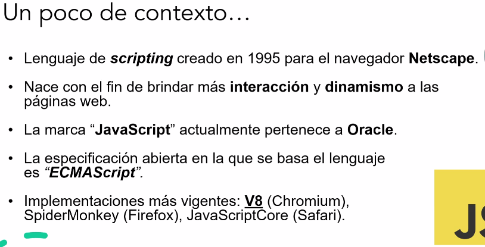

# Clase 1
[[29/03/2025]]

* Clases los lunes
* Talleres los Sábados

Enrique reinosa, Juan pablo y Ezequiel Escobar

**Javascript**

Lenguaje de scripting: Lenguaje que originalmente estaba pensado para dar dinamismo a los sitios web y no mucho más, pero a través de su evolución se transformo en un lenguaje de uso general7

* Lenguaje debilmente y dinámicamente tipado
    * Debilmente: puede cambiar de tipo
    * Dinámica : No se establece el tipo en tiempo de compilación, sino en tiempo de ejecución
* Modelo de objetos basado en prototipos. $\to$ Las clases no existen. Existen los prototipos
* Monohilo $\to$ Basado en el asincronismo: Hay un solo hilo de ejecución

Al ser un lenguaje con naturaleza asíncrona y basada en eventos, en su evolución se comenzó a utilizar en el lado del servidor *(Node.js, Deno, Bun)*

### [Enunciado trabajado: MegaSuper](https://docs.google.com/document/d/1ymC8HYAnxdVQ4hF-AtILktSxfUrcl5xzqM1J2NgA8KU/edit?tab=t.0)