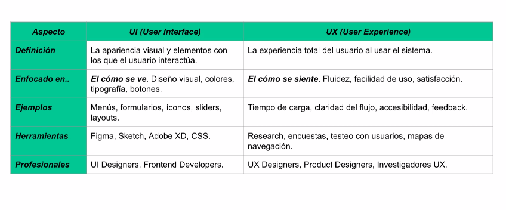
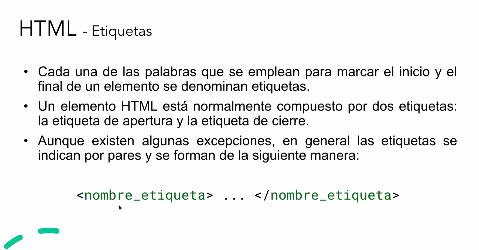

# Frontend

## UI vs UX



### DOM
* **DOM** significa **Document Object Model**
* Es una representación en forma de árbol del documento HTML cargado en el navegador, donde cada elemento de nuestro .html es un objeto o nodo con determinadas propiedades y funciones asociadas.
* Permite acceder y modificar dinámicamente cualquier elemento de la página desde JavaScript.




### HTML - Etiquetas
* Cada una de las palabras que se emplean para marcar el inicio y el final de un elemento se denominan etiquetas.
* Un elemento HTML está normalmente compuesto por dos etiquetas: la etiqueta de apertura y la etiqueta de cierre.
* Aunque existen algunas excepciones, en general las etiquetas se indican por pares y se forman de la siguiente manera:
```html
<nombre_etiqueta>
</nombre_etiqueta>
```


### HTML - Atributos
* Los atributos definen propiedades para un elemento. Estas propiedades habitualmente cambian la forma en que los navegadores interpretan al elemento.
* Los atributos son declarados indicando su nombre, seguido de un signo igual ("=") y el valor asignado entre comillas.

```html 
<a href="http://www.google.com">Este enlace apunta a la página de Google</a>.
```

> La etiqueta ```<a>``` por ejemplo se emplea para incluir un enlace en una página. Utilizando sólo la etiqueta ```<a>``` no es posible establecer la dirección a la que apunta cada enlace. Para ello lo que se hace es personalizar las etiquetas HTML mediante los atributos.

Hay 2 atributos básicos que se pueden aplicar a todas las etiquetas HTML:
* **id = "texto"** Establece un identificador único a cada elemento dentro de una página HTML
* **class = "texto"**  Establece la clase CSS que se aplica a los estilos del elemento


### CSS

