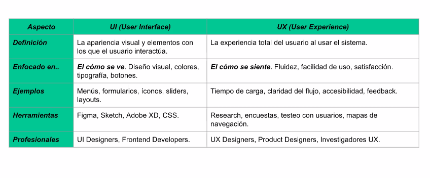

# Frontend

## UI vs UX



### DOM
*   **DOM** significa **Document Object Model**.
*   Es una representación en forma de árbol de todos los elementos visuales en la pantalla, el HTML cargado en la ventana. Cada elemento de nuestro `.html` es un objeto o nodo con determinadas propiedades y funciones asociadas.
*   Permite acceder, interactuar y modificar dinámicamente cualquier elemento de la página desde JavaScript, sin recargar la página.
*   El DOM provee objetos o instancias disponibles en JavaScript para interactuar con los elementos de la interfaz, siendo los dos principales **`Window`** y **`Document`**.
    *   El objeto **`Window`** representa la ventana del navegador y es el objeto global (ej: `window.alert()` para mostrar avisos).
    *   El objeto **`Document`** representa el HTML cargado en la ventana y permite acceder a distintos elementos (ej: `document.getElementById()`, `document.getElementsByClassName()`, `document.querySelector()`, `document.querySelectorAll()`, `document.getElementsByTagName()`).
*   Puedes cambiar propiedades de los elementos del DOM como el **`textContent`** (lo que se muestra) o **`innerHTML`** (el HTML interno), **`classList`** (para cambiar clases), **`style`** (para aplicar estilos en línea), o el **`value`** (para inputs).

### HTML - Etiquetas
*   Cada una de las palabras que se emplean para marcar el inicio y el final de un elemento se denominan etiquetas.
*   Un elemento HTML está normalmente compuesto por dos etiquetas: la etiqueta de apertura y la etiqueta de cierre.
*   Aunque existen algunas excepciones, en general las etiquetas se indican por pares y se forman de la siguiente manera:
    ```html
    <nombre_etiqueta>
    </nombre_etiqueta>
    ```
*   Ejemplos de etiquetas básicas incluyen **`p`** (párrafo), **`h1` a `h6`** (titulares), **`img`** (imagen), **`ul` / `ol` / `li`** (listas), **`title`** (título de la pestaña del navegador).
*   **`DIV`** es una etiqueta por excelencia, la más utilizada, que actúa como un **contenedor genérico y neutro** sin significado semántico. Sirve principalmente para agrupar y dividir contenido. Por ejemplo, muchas de las secciones en blanco de un campus virtual pueden ser `DIV`s agrupados por `class` para aplicar estilos.
*   **`input`** es un elemento para que los usuarios puedan ingresar datos, y puede tener un atributo **`placeholder`** para un texto de ejemplo.
*   **`select`** es un elemento que permite al usuario elegir una opción de una lista, utilizando etiquetas **`option`** dentro de él.
*   **`button`** es un elemento que representa un botón interactivo.

### HTML - Atributos
*   Los atributos definen propiedades para un elemento. Estas propiedades habitualmente cambian la forma en que los navegadores interpretan al elemento.
*   Los atributos son declarados indicando su nombre, seguido de un signo igual ("=") y el valor asignado entre comillas.
    ```html
    <a href="http://www.google.com">Este enlace apunta a la página de Google</a>.
    ```
*   La etiqueta `<a>` por ejemplo se emplea para incluir un enlace en una página. Utilizando sólo la etiqueta `<a>` no es posible establecer la dirección a la que apunta cada enlace. Para ello lo que se hace es personalizar las etiquetas HTML mediante los atributos.
*   Hay 2 atributos básicos que se pueden aplicar a todas las etiquetas HTML:
    *   **`id = "texto"`**: Establece un **identificador único** a cada elemento dentro de una página HTML. Es muy importante porque JavaScript puede acceder a los elementos por su ID para interactuar con ellos.
    *   **`class = "texto"`**: Establece la **clase CSS** que se aplica a los estilos del elemento. Los `div`s suelen agruparse por clases para que una clase CSS les dé estilo.


### CSS
*   CSS (Cascading Style Sheets) se encarga del **estilo** de los elementos HTML, dándoles forma, color o estructuras diferentes.
*   **Enlace de archivos CSS**:
    *   La forma más prolija es enlazar un archivo `.css` externo a tu HTML usando la etiqueta **`<link>`**.
        *   La etiqueta `<link>` se coloca en la sección **`<head>`** de tu HTML.
        *   Requiere los atributos:
            *   **`rel="stylesheet"`**: Indica que la relación es con una hoja de estilos.
            *   **`type="text/css"`**: Indica el tipo de recurso enlazado.
            *   **`href="url_del_archivo.css"`**: Indica la URL del archivo CSS que contiene los estilos. Puede ser una ruta relativa o absoluta.
    *   También se puede escribir código CSS directamente dentro del HTML usando la etiqueta **`<style>`**, pero **no es lo más prolijo**.
*   **Reglas CSS**:
    *   CSS trabaja con **reglas**, y cada regla es un conjunto de estilos aplicados a uno o más elementos.
    *   Una regla CSS está compuesta por un **selector**, un símbolo de **llave de apertura `_`**, una **declaración** (que contiene una o más propiedades y sus valores), y un símbolo de **llave de cierre `}`**.
    *   Ejemplo: `H1 { color: black; }`.
    *   Las reglas CSS se parecen a un JSON.
*   **Selectores CSS**:
    *   El selector indica el elemento o elementos HTML a los que se aplica la regla CSS.
    *   Tipos de selectores:
        *   **Por elemento (o tipo de etiqueta)**: Aplica el estilo a todas las instancias de una etiqueta específica (ej: `h1 { ... }` para todos los H1). Puedes aplicar la misma regla a múltiples elementos separándolos por coma (ej: `h1, h3 { ... }`).
        *   **Por clase**: Selecciona todos los elementos que tengan una clase específica. Se define en CSS con un punto antes del nombre de la clase (ej: `.titulo { ... }`). Un elemento HTML puede tener múltiples clases asignadas, separadas por espacios (ej: `class="gris letraGrande"`).
        *   **Por ID**: Selecciona un elemento específico por su ID. Se define en CSS con un numeral antes del nombre del ID (ej: `#miBoton { ... }`). Aunque no se detalla en los ejemplos de CSS, se menciona que las reglas pueden ser por ID.
*   **Declaración CSS**:
    *   La declaración especifica los estilos que se aplican a los elementos seleccionados.
    *   Está compuesta por una o más **propiedades CSS** y sus **valores**.
    *   **Propiedad**: La característica que se modifica (ej: `color`, `font-size`, `text-align`, `font-family`, `line-height`).
    *   **Valor**: Establece el nuevo valor de la característica (ej: `red`, `black`, `navy`, `gray`, `32px`, `center`, `Arial, sans-serif`, `1.5em`).
    *   Los colores pueden definirse por nombre (ej: `red`, `blue`, `white`) o en formato hexadecimal (ej: `#FF0000` para rojo). Puedes usar herramientas como "color pickers" para obtener códigos de color de una pantalla.
    *   Ejemplos de propiedades y valores:
        *   `color: navy;` (cambia el color del texto a azul marino).
        *   `font-size: 32px;` (establece el tamaño de la fuente en 32 píxeles).
        *   `text-align: center;` (centra horizontalmente el texto dentro de su contenedor, que puede ocupar todo el ancho disponible). Otros valores incluyen `end`, `justify`, `left`, `right`, `start`.
        *   `font-family: Arial, sans-serif;` (aplica la fuente Arial o una genérica Sanserif si no está disponible).
        *   `line-height: 1.5em;` (establece la altura de la línea para mejorar la legibilidad).
*   **Hoja de Estilo en Cascada (CSS Cascade)**:
    *   Cuando hay reglas que se solapan o entran en conflicto, la **última regla aplicada es la que prevalece**. CSS lee de arriba hacia abajo, aplicando la primera regla y luego las siguientes, de modo que la última aplicada "pisa" a las anteriores si hay conflicto en la misma propiedad.
    *   Puedes inspeccionar los elementos en el navegador para ver qué estilos se están aplicando y cuáles están siendo pisados.
    *   **`!important`**: Se puede usar para dar **prioridad** a una regla específica, forzando que no sea pisada por otras reglas, incluso si se aplican después. Sin embargo, **no se debe abusar** de esta regla.
*   **Clases Atómicas y Reutilización**:
    *   Es ideal que las clases CSS sean lo **más atómicas posibles** (es decir, que cada clase defina una sola característica o un conjunto muy específico) para que puedan **combinarse y reutilizarse** fácilmente en diferentes elementos.
*   **Desafío al Centrar `DIV`s**:
    *   Centrar elementos `DIV` o disponer varios `DIV`s uno al lado del otro y que ocupen lo mismo, puede ser complejo y no trivial.
    *   Para acomodar elementos en pantalla de forma más eficiente, existen herramientas como **Flexbox**, que se verá más adelante y es muy útil en frameworks como React.
*   **Diseño Responsivo**:
    *   El diseño de la aplicación debe **adaptarse y ser completamente funcional** en distintos dispositivos como desktops, tablets y móviles, asegurando que todos los elementos sean accesibles sin afectar la usabilidad.
    *   Se puede probar el diseño responsivo directamente en las herramientas de desarrollo del navegador, cambiando las medidas de la pantalla.
*   **Accesibilidad (Good Practices)**:
    *   Se deben seguir buenas prácticas de accesibilidad, como el uso de **contrastes adecuados**, **etiquetas ARIA**, **soporte de navegación mediante teclado**, y que los textos y botones sean lo suficientemente grandes para facilitar el uso en dispositivos móviles.
*   **Consistencia de la UI**:
    *   Los **estilos, colores y tipografías deben ser homogéneos** en toda la aplicación para mejorar la experiencia del usuario y evitar confusión. Los componentes reutilizables deben seguir un diseño coherente.
    *   Esto implica que si, por ejemplo, los botones tienen puntas redondeadas, la mayoría de los elementos de diseño deberían seguir esa misma coherencia.
*   **Herramientas y Futuro**:
    *   Aunque es crucial entender los fundamentos de CSS, las **herramientas de IA generativa** pueden ayudar a generar código CSS, guiando el proceso.
    *   El conocimiento de HTML, CSS y JavaScript es fundamental para trabajar con frameworks de componentes como **React**, que te permiten construir interfaces dividiéndolas en partes pequeñas, reutilizables e independientes.
