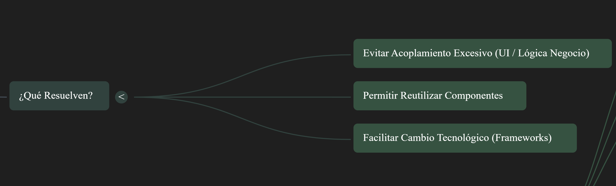
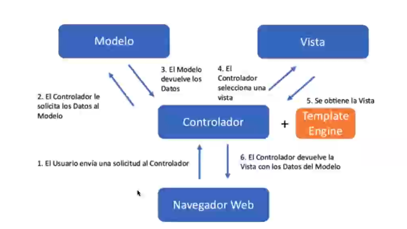
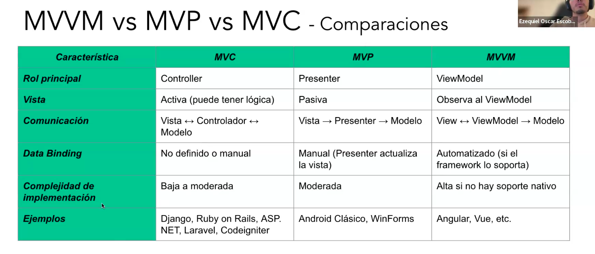

## Patrones de interacción
Los patrones de interacción son los encargados de organizar la forma en la que las distintas capas de una aplicación interactúan entre sí
Objetivos principales: 
* Separacion de responsabilidades: Cada capa tiene un rol claro y específico (Single Rensponsability Principle)
* Facilita el mantenimiento y la evolución de app complejas
* Promueve el testing aislado de lógica y presentación 
* Mejora la legibilidad y la colaboración entre equipos (back/front)

### MVC

1. Modelo (Model): Contiene la gestión del estado de los datos y la lógica de negocio del sistema. Está relacionado con las reglas de negocio. Dentro del Modelo, se consideran las entidades de dominio y los repositorios. También, aunque no explícitamente mencionado en la teoría básica de MVC, la capa de servicios encajaría entre el Modelo y el Controlador, ya que implementa lógica de negocio y orquesta casos de uso. El Modelo envía los datos solicitados para ser visualizados, a través del Controlador en el contexto web. Encapsula el estado del sistema, refiriéndose al estado interno de las entidades que manipula.
2. Vista (View): Es la representación visual de los datos, es decir, la interfaz de usuario (UI). Presenta los datos en un formato adecuado para el usuario. Posee lógica de presentación para mostrar los datos de forma amigable y envía las acciones del usuario al Controlador. En el contexto web, es típicamente un template HTML.
3. Controlador (Controller): Es quien recibe las entradas del usuario (usualmente acciones). Maneja la petición que llega desde el cliente. Actúa como intermediario entre el Modelo y la Vista. Invoca peticiones al Modelo (o capa de servicios) cuando se hace alguna solicitud sobre datos. Define el comportamiento del sistema y traduce las acciones del usuario en actualizaciones del Modelo. Selecciona una Vista y decide cuál debe mostrar.

#### Historia y Evolución de MVC:
 El patrón MVC fue introducido en los años 70 en Smalltalk. Inicialmente, fue diseñado para interfaces gráficas en aplicaciones de escritorio (desktop). En un MVC típico desktop (o "purista"), el flujo de interacción era: el usuario interactúa con la Vista -> la Vista delega al Controlador -> el Controlador actualiza el Modelo -> y el Modelo notifica directamente a la Vista de los cambios, a menudo a través del patrón Observer o mediante binding. La Vista se actualiza automáticamente o manualmente.

**MVC Web**: El patrón MVC se adapta al entorno web debido a la naturaleza sin estado del protocolo HTTP. Actualmente, la mayoría de los desarrollos web con interfaz gráfica se inspiran en MVC o alguna variante. El flujo típico de MVC en una web:
1. El navegador (cliente) hace una solicitud HTTP al servidor.
2. El Controlador, a menudo manejado por un Framework que se encarga del ruteo, maneja la petición.
3. El Controlador consulta al Modelo (que incluye la lógica de negocio y acceso a datos/repositorios).
4. El Modelo accede al medio persistente (base de datos) y retorna los datos.
5. El Controlador selecciona una Vista (un template HTML).
6. El controlador, con la ayuda de un motor de plantillas (template engine), renderiza (rellena) ese template HTML con los datos obtenidos del Modelo.
7. Se devuelve una respuesta HTML completa al cliente (navegador). A diferencia del MVC desktop, en MVC Web el Modelo no notifica directamente a la Vista; el Controlador orquesta la actualización de la Vista renderizando un nuevo HTML.

## MVVM
MVVM es un patrón de interacción que separa la UI, la lógica de negocio, y el manejo del estado, facilitando el _data binding_ automático entre la vista y el modelo de datos

La estructura del MVVM consta de tres componentes:
1. Modelo (Model): Contiene la lógica de negocio y el acceso a los datos.
2. Vista (View): Es la interfaz de usuario (UI), compuesta, por ejemplo, por código HTML. Es donde el usuario interactúa.
3. Vista Modelo (View Model): Este componente reemplaza al Controlador de MVC. Es el encargado de exponer los datos y los comandos a la vista. Contiene la lógica de presentación y también tiene estado. En el contexto de un framework, podría ser una clase _'objetosa'_ asociada a la vista, con atributos y métodos llamables directamente desde la vista.
Las interacciones en MVVM se describen de la siguiente manera:
    * La Vista observa al View Model.
    * El View Model interactúa con el Model.

Características mencionadas de MVVM:
*  Alto nivel de desacoplamiento entre la vista y la lógica (de negocio, que está en el backend separado en una arquitectura distribuida).
* Es ideal para el data binding bidireccional.
* Es común en frameworks declarativos o reactivamente orientados.
Ejemplos de uso de MBVM incluyen:
* Frameworks web como Angular y View.
* Aplicaciones móviles con Android moderno.
* Aplicaciones de escritorio con tecnologías como Windows Presentation Foundation (WPF).

####  Data binding
 Técnica que permite sincronizar automáticamente el estado de la UI con los datos de la app (modelo o viewModel)

Existen 2 tipos de **Data binding** : 
Bidireccional (two-way) 
* Cambios en al UI actualizan el modelo y viceversa
* Tipico en MVVM con frameworks como Angular, Vue, etc.

Unidireccional (one-way)
* Los datos fluyen solo del modelo a la vista
* Típico en React, o MVP dende la vista es pasiva

### MVP

El MVP es uno de los patrones de interacción mencionados en la agenda. Se presenta como una evolución de MVC.
En MVP, el componente clave que aparece es el Presentador (Presenter). El Presenter actúa como intermediario entre la Vista (View) y el Modelo (Model).

La estructura del MVP se compone de tres elementos principales:
* Modelo (Model): Contiene los datos y la lógica de negocio.
* Vista (View): Es la interfaz de usuario (UI). Una característica fundamental en 
MVP es que la vista es totalmente pasiva y delega toda lógica al Presenter
* Presentador (Presenter): Contiene la lógica de presentación, controla la vista y coordina con el modelo.

El concepto de que la Vista es pasiva significa que:
* Solamente va a mostrar, no va a tener otra lógica.
* Se encarga de mostrar y nada más.
* En un contexto web, es esencialmente código HTML puro y nada más.
* Delega toda la lógica al presentador.
* Las vistas son más fáciles de testear porque no tienen lógica.

Las interacciones en MVP ocurren de la siguiente manera:
* Las acciones del usuario (eventos) se envían desde la Vista hacia el Presentador.
* El Presentador interactúa hacia la Vista y el Modelo.
Este patrón también se menciona en relación con el data binding unidireccional, donde los datos fluyen solo del modelo a la vista.

---
## Rendering
El rendering es el proceso de generar la UI 
Si nos situamos en una Arq web el proceso de rendering se puede dar tanto del lado del cliente como del servidor

### Server Side Rendering - SSR

El HTML se genera en el lado del servidor ante cada solicitud del usuario
Flujo tipico consta de : 
1. El navegador hace una petición HTTP
2. El servidor ejecuta lógica (acceso a BD, generación de templates, etc.)
3. Genera HTML completo y lo envía al navegador
4. El navegador lo muestra inmediatamente

A las webs de este tipo se las conoce como **"Clientes livianos"**

✅Ventajas
 * Simplicidad en apps con poca interacción.
 * SEO amigable (el contenido ya está renderizado)

❌Desventajas
 * Cada cambio requiere una nueva petición al servidor 
 * Menor interactividad (sin JS, no hay dinamismo)
 * Puede generar más carga en el servidor

### Client Side Rendering - CSR
El servidor entrega una  página vacía (HTML mínimo) y el código JS en el navegador se encarga de renderizar **todo**

Flujo tipico consta de : 
1. El navegador pide una página -> Recibe HTML básico + JS (del servidor) 
2. El navegador descarga y ejecuta el JS
3. El JS construye la UI (DOM) y carga datos desde APIs.

A las webs de este tipo se las conoce como **"Clientes pesados"**

✅Ventajas
 * Mayor interactividad ya que tiene una experiencia muy fuida e interactiva
 * Menor carga del servidor
 * Ideal para apps con muchas interacciones o componentes en tiempo real

❌Desventajas
 * Peor SEO si no se usa un prerendering -> Ya que el SEO busca por el HTML de la página, y si se renderiza todo del lado del cliente no se corresponde una buena posicion SEO
 * Mayor complejidad inicial y en seguridad 

 Tambien hay intermedios, por ejemplo existen los trabajos en islas donde tengo ciertos sitios que se manejan por SSR pero ciertas partes de ese sitio que funcionan como CSR. Esto ofrece flexibilidad para ofrecer una mejor experiencia de usuario por ejemplo.

