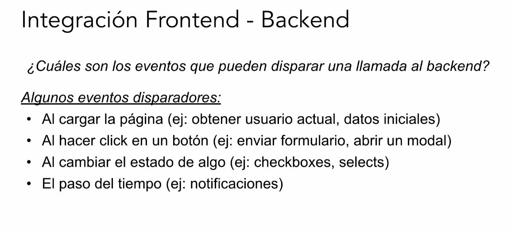
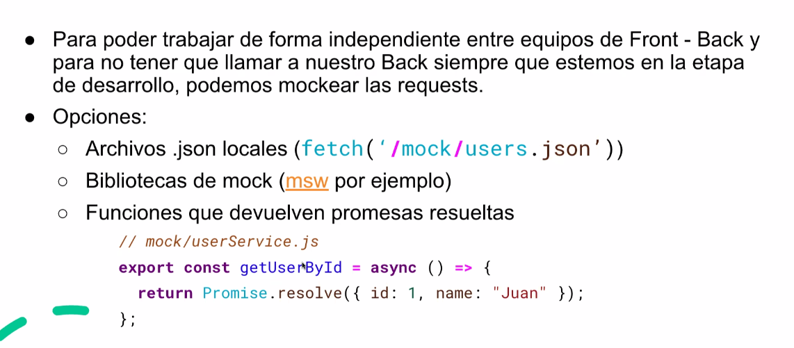

# Integración front-back

¿Dónde se realizan las llamadas?

Basandonos en los principios SOLID, pensando en cualidades de diseño...

* Las llamadas las podríamos implementar en archivos " **services** " o "**api**"
* Dentro de cada archivo service/api, podemos diseñar nuestra solución o bien como funciones "sueltas" o bien como una clase que contenga un método por cada llamada a un endpoint
* Dependiendo de qué tan bien diseñemos esta parte de la solución, más sencillo (o complicado) resultará el mocking de nuestras requests.

# Cuestiones de sincronismo

Estas llamadas a las apis o services se realizan de manera asincronica

# Manejo de users