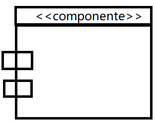
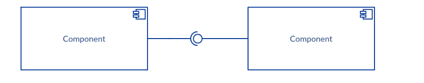

###### Desarrollo de Software
Se puede definir al D. de SW como el proceso sistemático de conepción de diseño, implementación, pruebas, despliegue  y mantenimiento de sistemas de software.

###### Arq. de Software
Estructura/s del sistema que consiste en componentes de SW

---

#### Diagrama UML
**Formas de representar un componente en un Diagrama UML**

    En esta imagen se puede apreciar como el compoenente de la izquierda consume la interfaz expuesta por el componente de la derecha. 
    [comment]: <> (Falta actualizar la imagen por la representacion del componente visto en clase) 

---
## Modelo de desarrollo basado en capas

1. Presentación $\Rightarrow$ La interfaz que se expone, es la capa externa 
2. Dominio $\Rightarrow$ Todas las reglas del negocio / proceso
3. Datos $\Rightarrow$ como se almacenan los datos

---
### Framework vs biblioteca 
* Los framewoks definen la forma en la que se estructura el código y cómo se ejecutan los procesos, eventos, etc. Estos poseen **control inverso** ya que son ellos los encargado de controlar el flujo de ejecucion y es él el que llama al programa

* Una biblioteca posee **control directo**, porque la llama el programador. 