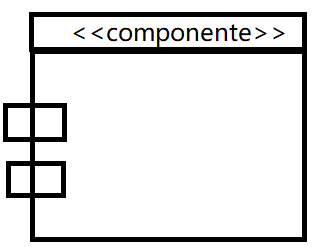
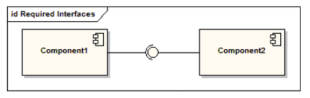
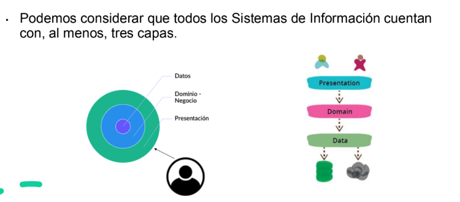
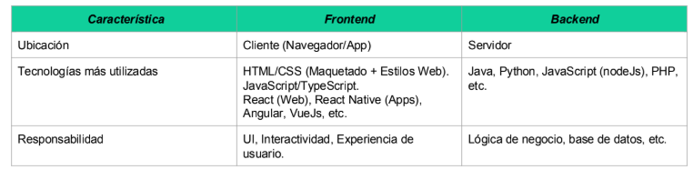

#### Desarrollo de Software
* Se puede definir al D. de SW como el proceso sistemático de conepción de diseño, implementación, pruebas, despliegue  y mantenimiento de sistemas de software.
* Implica la aplicación de principios de ingeniería, metodologías y herramientas para crear SW eficiente, escalable y mantenible que cumpla con requisitos funcionales y no funcionales

#### Arq. de Software

* Estructura/s del sistema que consiste en componentes de SW, las propiedades externas visibles de esps componentes y las relaciones entre ellos.
* Un **componente** es una pieza de software que puede ser código fuente, código binario,
un ejecutable, o una biblioteca con una interfaz definida.
* Cada componente tiene su **ciclo de vida**: repositorio, equipo que lo mantiene, esquema de versionado, agenda de despliegues, etc.

* ¿Qué es la interfaz de un componente?

    * Una interfaz establece las operaciones externas de un componente, las cuales
determinan una parte del comportamiento del mismo.

---
## Formas de representar un componente en un Diagrama UML

En esta imagen se puede apreciar como el compoenente de la izquierda consume la interfaz expuesta por el componente de la derecha. 

---
## Modelo de desarrollo basado en capas

* Cada capa es un todo coherente (cohesión), con un rol único en el sistema

* Las capas superiores usan servicios de las inferiores, pero no así de forma contraria o saltando niveles

1. Presentación $\Rightarrow$ La interfaz que se expone, es la capa externa 
2. Dominio $\Rightarrow$ Todas las reglas del negocio / proceso
3. Datos $\Rightarrow$ como se almacenan los datos

---
### Backend vs Frontend
* El frontend es la capa de presentación gráfica del Sistema con la que
interactúa el usuario.

* Se ejecuta en el navegador o en una aplicación cliente (aplicación
mobile, por ejemplo) y se encarga de la presentación de la información y
la experiencia de usuario.

---
### Framework vs biblioteca 
#### Biblioteca
* La biblioteca se desarrolla, se compila y se carga de forma separada al
código de nuestra aplicación, pero las funcionalidades que define son
utilizadas indistintamente por nuestro código como si de parte de él se
tratase.
* Resuelven un problema de reutilización de lógica asociada a abstracciones, representada e implementada a través de código
* Una biblioteca posee **`control directo`**, porque el control de fluo del programa es controlado por el programador. Es éste quien llama a las operaciones definidas por la libreria
* Las bibliotecas son llamadas por nosotros cuando **`las necesitamos`**

#### Framework
* Los frameworks definen una estructura, una forma de trabajar siguiendo determinados lineamientos.
* No solo se definen funciones y componentes que pueden ser
reutilizados, sino que se definen piezas de software reutilizables que
permiten ser extendidas para cubrir las necesidades particulares de
cada proyecto pero a su vez definen una forma, un marco de trabajo
común para todos ellos.
* Los framewoks definen la forma en la que se estructura el código y cómo se ejecutan los procesos, eventos, etc. Estos poseen **control inverso** ya que son ellos los encargado de controlar el flujo de ejecucion y es él el que llama a las funciones abstractas que el usuario define en concreto