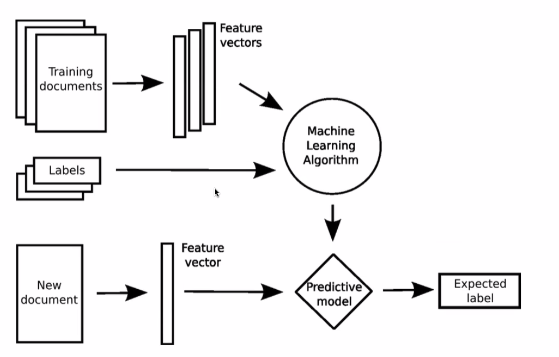

### Herramientas de apoyo para la generacón de código
**¿Que es la inteligencia Artificial?**
* La IA es una rama de la informática que estudia el diseño de Sistemas capaces de realizar tareas que normalmente requieren de la inteligencia humana, como el aprendizaje, el razonamiento, la planificación y la comprensión del lenguaje natural.

* Presenete en asistentes virtuales, chatbots, análisis de datos y ahora también en el desarrollo de software.

### Clasificación de la IA por su capacidad
* **IA débil**: Sistemas diseñados para realizar tareas específicas, como asistentes virtuales o chatbots. No tienen conciencia ni comprensión real.
Ejemplos incluyen Siri, Gemini, Alexa y chatbots de atención al cliente.
* **IA fuerte**: Sistemas que pueden entender, razonar y aprender de manera similar a los humanos. Aún no se ha logrado desarrollar una IA fuerte.

### Clasificación por técnicas o enfoques utilizados
| **Tipo de IA**           | **Descripción breve**                                       | **Ejemplos**                     |
|--------------------------|-------------------------------------------------------------|----------------------------------|
| IA Simbólica             | Reglas lógicas y conocimiento explícito                     | Sistemas expertos, Prolog        |
| Machine Learning         | Aprende de patrones a partir de datos                       | Clasificadores                   |
| Deep Learning            | Redes neuronales profundas                                  | Reconocimiento de imágenes       |
| Algoritmos evolutivos    | Inspirados en la biología (mutación, selección)             | Optimización, robótica           |

### Clasificacion por tipo de tareas que realiza
| **Tipo de IA**        | **Descripción breve**                                           | **Ejemplos**                               |
|-----------------------|------------------------------------------------------------------|--------------------------------------------|
| IA discriminativa     | Clasifica, predice o decide                                     | Diagnóstico médico, recomendadores         |
| IA generativa         | Crea nuevo contenido (texto, imagen, video, código, etc.)       | ChatGPT, Copilot                           |
---
**¿Qué es un modelo?**
* Un modelo es una representación matemática del conocimiento aprendido a partir de los datos.
* Se entrena con ejemplos para identificar patrones y hacer predicciones o generar contenido.
* Cada modelo tiene: 
    * Parámetros(números ajustados durante el entrenamiento)
    * Arquitectura(estructura que define cómo procesa información)
Ejemplo simple: Una red neuronal que predice si un mail es spam o no.

Ejemplo 

* Si queremos entrenar un modelo para saber si un alumno aprobará una materia:
    Que datos importan ? 
    * si trabaja o no trabaja
    * Edad
    * Cantidad de materias aprobadas
    * Cantidad de materias desaprobadas
    * Genero
    * Localidad
* Si bien hay dataset ya creados que podemos utilizar, es importante que el dataset sea representativo y contenga ejemplos variados para que el modelo aprenda de manera efectiva. 
Si en nuestro ejemplo utilizamos un dataset de EEUU y queremos aplicarlo en Argentina, es probable que no funcione bien porque las condiciones y contextos son diferentes.
Por ello es importante la calidad del dataset y la diversidad de ejemplos que contenga.

**¿ Como aprenden los modelos?**
* A través de un proceso llamado entrenamiento:
    * Se le dan datos de entrada y se compara su salida con la respuesta correcta.
    * Se ajustan los parámetros del modelo para minimizar el error entre la salida del modelo y la respuesta correcta.
* Este proceso se repite muchas veces hasta que el modelo aprende a generalizar y hacer buenas predicciones o generar contenido relevante.
* El resultado es un modelo que generaliza lo aprendido a nuevos casos

Las IA generativas tambien son entrenadas de esta manera, pero en lugar de clasificar o predecir, generan nuevo contenido (texto, imágenes, código, etc.) a partir de patrones aprendidos en los datos de entrenamiento.

**¿Que es la IA generativa?**
* Rama de la IA que genera nuevo contenido a partir de datos aprendidos.
* Se entrena con grandes volúmenes de información.
* Capaz de producir texto, imágenes, música, código, etc.
* No siempre repite : Intenta crear nuevas combinaciones. (A veces repite la salida, pero no es su objetivo principal, puede llegar a modificar la salida)

### Temperatura de un modelo
En un modelo generativo:
* La temperatura es un parámetro que controla el grado de aleatoriedad en las respuestas generadas.
* Una temperatura baja (cercana a 0) hace que el modelo sea más determinista y predecible.
* Una temperatura alta (cercana a 1) hace que el modelo sea más creativo y variable o impredecible.
* Importante para ajustar precisión vs. diversidad en generación de código. -> Si queremos utilizar una IA generativa para generar código, debemos tener en cuenta la temperatura para que el código  y que tal vez con una temperatura alta, el código generado no sea siempre el más óptimo o correcto.

### Semilla de un modelo (Seed)
* Una semilla es un valor numérico inicila que controla la aleatoriedad de un modelo.
* Teoricamente Usar la misma semilla en diferentes ejecuciones garantiza resultados consistentes. Pero en la práctica, puede haber variaciones debido a la naturaleza de los modelos y su entrenamiento.

Claro, aquí está el **texto completo** de la imagen y una **explicación ampliada** al final:

---

## **Temperatura y Semilla** – Controlando la generación

### **Temperatura**

* Controla la *aleatoriedad de las respuestas*.
* Afecta la *diversidad de resultados* posibles ante un mismo prompt.

### **Semilla (seed)**

* Controla la *reproducibilidad de resultados*.
* Misma semilla + misma temperatura + mismo prompt = mismo resultado (en teoría).

### **Relación clave**

* Con **temperatura alta**, la semilla cobra más relevancia porque se abren múltiples caminos posibles.
* Con **temperatura baja**, el modelo se vuelve más predecible (la semilla importa menos si hay poca variación posible).

---
### Ejemplo de uso de temperatura y semilla

Si usas temperatura 0.9 y seed 1234 para un mismo prompt, podés tener una historia muy creativa. Si repetís el experimento con otra seed, cambia completamente. Pero si bajás la temperatura a 0.2, ambas seeds podrían generar respuestas similares (porque hay menos espacio para variar).

# Aplicación al Desarrollo de software
* Hoy existen modelos que escriben código
* Conocen lenguajes de programación, frameworks y buenas prácticas.
* Asisten al desarrollador con sugerencias, documentación, testeo y refactorización.

### Ejemplos de herramientas de IA generativa para desarrollo
* Github copilot: El más conocido, integrado en editores como Visual Studio Code.
* Cursor: Editor basado en VsCode con funciones de IA generativa.
* Asistentes en los IDEs de JetBrains

### Prompt 
* Un prompt es una instrucción o pregunta que se le da a un modelo de IA generativa para que produzca una respuesta.
* Determina completamente la calidad de la respuesta.
* Es el "input humano" en esta nueva forma de programación.
**¿Como escribir buenos prompts?**

* **Sé claro y específico**: Cuanto más claro y específico seas, mejor será la respuesta. Evita ambigüedades.
* **Proporciona contexto**: Si es necesario, proporciona información adicional para que el modelo entienda mejor lo que necesitas.
* **Ejemplos** : Si podés, mostrale el formato o estilo que esperás.
* **Iteración**: No siempre sale bien al primer intento, en ese caso hay que ajustar y refinar tu prompt si la respuesta no es lo esperado.

**¿Acelera el desarrollo?**
1. Ayuda en la generación de código repetitivo o boilerplate.
    

2. Acelera prototipado

    * Crear una API REST básica con endpoints CRUD.
    * Diseñar una interfaz simple con React o HTML/CSS.
    * Simular datos falsos (mock data) para probar una UI.
    * Escribir scripts rápidos de análisis de datos o migración.

3. Mejora la productividad
    * Refactorizar nombres de variables para que sigan una convención.
    * Repetir estructuras de tests para múltiples funciones similares.
    * Esrcribir comentarios o documentación básica.
    * Traducir código de un lenguaje a otro. (Con limitaciones) 

**Pero no reemplaza el entendimiento humano!!**

Aquí tienes el texto de la imagen, con una ampliación al final:

---

## **Riesgos y desafíos:**
* A nivel software:
    * Código incorrecto o inseguro si se usa sin revisión.
    * Sesgos del modelo si el entrenamiento fue defectuoso.
* A nivel personal:
    * Dificultad para aprender si se depende demasiado de estas herramientas.
* A nivel legal:
    * Posibles problemas de licencias (*copyright*).
