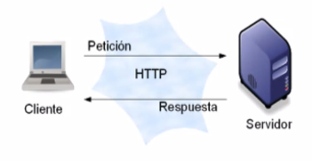
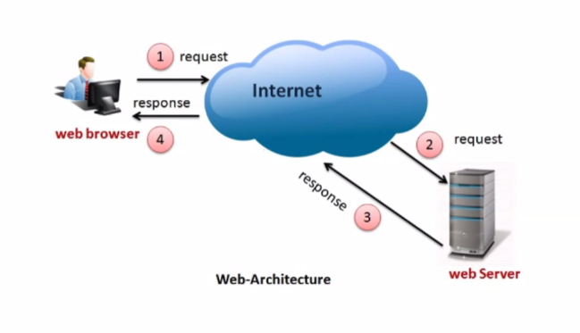

[[07/04/2025]]

###### Temario
###### Desarrollo Backend - Parte I
- Arquitectura Cliente - Servidor. 
- Arquitectura Web. 
- API y API REST. Objetivo. Funcionamiento.

###### Repaso de clase anterior
* Modelo basado en capas

---

## Arquitectura Cliente - Servidor
Es una arquitectura donde participan 2 componentes:

* El servidor provee uno o más servicios a través de una interfaz (no necesariamente gráfica)
* Un cliente que usa esos servicios como parte de su operación en el acceso al servidor
    * El cliente es el que inicia la conexión 

Se pueden clasificar según las responsabilidades: 
 * <u>Cliente activo, Servidor pasivo</u> $\to$ el cliente es quien posee la mayor cantidad de la lógica del negocio. El servidor limita su funcionalidad a la persistencia
 * <u>Cliente pasivo, Servidor pasivo</u>  $\to$ Ambos componentes poseen baja lógica de negocio o simplemente son considerados "componentes intermedios" de algo "más grande"
 * <u>Cliente pasivo , Servidor activo ("Cliente liviano")</u>  $\to$ El servidor posee la mayor lógica de negocio, mientras que el cliente se limita a presentar los datos
 * <u>Cliente activo, Servidor activo</u>  $\to$ la lógica de negocio está distribuida en ambos componentes. El cliente posee la lógica de presentación de los datos.

Analizando ventajas y desventajas sobre un **Cliente Pasivo - Servidor Activo** 
<u>Ventajas</u>:
* Mantenibilidad: Cambios de funcionalidad Centralizados
* Seguridad: Centralización de Control de Accesos a recursos

<u>Desventajas (*)</u>:
* Eficiencia (tiempo de respuesta): El servidor puede ser un cuello de botella
* Disponibilidad: Único punto de falla $\to$ Considerando un único Servidor

---
## HTTP (HyperText Transfer Protocol / Protocolo de transferencia de hipertexto)
Protocolo de comunicación basado en el modelo **<u>C-S</u>** que define cómo se deben intercambiar datos en la web. Es un protocolo de aplicación dentro de la pila de protocolos de Internet y funciona sobre TCP
* Pertenece a la capia

###### Funcionamiento básico
1. cuando un clinete (normlamente un navegador) necesita acceder a un recurso en la web, envía una solicitud HTTP (HTTP request) a un servidor web
2. Este servidor procesa la solicitud y responde con una respuesta (response)

---

## Arquitectura Web
Es una arquitectura basada en el protcolo <u>**C-S**</u> pero en el medio tanto el servidor como el cliente se comunican a traves de internet.

* La Arquitectura Web es el conjunto de principios, tecnologías y estructuras que definen cómo se organizan y comunican los componentes de una aplicación web.

* Se basa en la interacción entre clientes y servidores a través de protocolos como HTTP/HTTPS, permitiendo la distribución de información y la ejecución de aplicaciones en la web.

---
## API REST
Se basa en el protocolo HTTP y es una de las arquitecturas más populares para desarrollar APIs