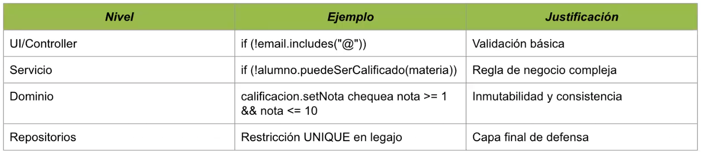

Temas:
- Desarrollo Backend - Parte II
- Capa de Dominio Capa de Services, Capa de Controladores, Capa de Repositorios.
- Manejo de errores.

La clase del 14 de abril de 2025 se centró en la **orquestación de casos de uso** y la **organización de proyectos** a través de la **separación de responsabilidades en distintas capas**. El objetivo principal fue clarificar cómo asignar responsabilidades para el desarrollo de un caso de uso completo.

Los temas principales abordados en la clase fueron:

*   **Orquestación de casos de uso**: Se discutió la importancia de ordenar las ideas para asignar responsabilidades a diferentes capas y cómo desglosar un caso de uso para su desarrollo completo.
    *   Se planteó una **confusión conceptual común**: asignar responsabilidades de casos de uso directamente a clases que representan actores en el sistema (ej., una clase `Huesped` con un método `crearReserva`). Esto se considera incorrecto porque mezcla el modelo de dominio con la orquestación de casos de uso y la lógica de presentación.
    *   La solución propuesta es **separar claramente la lógica de orquestación (casos de uso) de los modelos de dominio y las políticas de acceso**. El foco no debe estar en *quién* lo hace, sino en *qué* se hace y *cómo* se orquesta la lógica de negocio. No todo actor en un diagrama de casos de uso se transformará necesariamente en una clase de dominio.

*   **Capas del sistema**: La clase profundizó en la responsabilidad de cada una de las siguientes capas:
    *   **Capa de Dominio**:
        *   Contiene la **lógica de negocio pura**, incluyendo reglas, validaciones, entidades y objetos de valor.
        *   Es el **corazón del sistema** y debe ser diseñada de forma **independiente de la infraestructura o *frameworks*** (agnóstica).
        *   Todo lo visto en materias previas como Paradigmas y Diseño de Sistemas (entidades, lógica de negocio, reglas) corresponde a esta capa.
        *   Ejemplos incluyen las clases `Alumno`, `Calificacion` y `Materia`, las cuales son consideradas entidades *core* del sistema.
        *   Las entidades son **ricas en lógica** y **autocontenidas y validadas** (ej., `Calificacion` valida la nota entre 0 y 10 en `setNota`).
        *   Se evita mezclar permisos, interfaces o actores externos.
        *   Ventajas incluyen facilidad de testeo, maximización de reutilización y flexibilidad, y evitación de modelos de dominio anémicos (clases sin métodos) y duplicación de reglas de negocio. También propicia los principios SOLID de Abierto/Cerrado y Sustitución de Liskov.

    *   **Capa de Repositorios**:
        *   **Encapsula el acceso al medio persistente** (memoria, archivos, bases de datos).
        *   **Traduce las entidades del dominio** a un formato persistible y viceversa.
        *   Propone la existencia de **objetos *repository*** con métodos para agregar, modificar, eliminar y buscar objetos (ej., `agregarAlumno`, `buscarPorLegajo`).
        *   Es crucial que las **entidades de dominio no conozcan la existencia de los repositorios**, pero los repositorios sí conocen las entidades de dominio, asegurando un acoplamiento unidireccional.
        *   No toda entidad de dominio necesita su propio repositorio.
        *   Ventajas: permite **cambiar la tecnología de persistencia sin alterar el dominio** y facilita el *testing* mediante *mocks* o implementaciones en memoria (ej., un repositorio en memoria para pruebas).
        *   Beneficia los principios SOLID de Segregación de Interfaces (I) e Inversión de la Dependencia (D).

    *   **Capa de Services**:
        *   **Orquesta la ejecución de una operación de negocio** y llama a los objetos de dominio, repositorios y otros utilitarios.
        *   Separa **el *cómo* se hace algo (dominio) del *cuándo* y *en qué orden* se hace**.
        *   Se enfoca en las **reglas de flujo** (la secuencia de acciones de un caso de uso), no las reglas de negocio puras (que están en el dominio).
        *   Ejemplo: el flujo de registrar una calificación incluye validar la existencia del alumno y la materia, crear la calificación, agregarla al alumno y persistirla.
        *   Los *services* reciben los repositorios como interfaces (inyección de dependencias), lo que los hace **independientes de la implementación concreta de la persistencia**.

    *   **Capa de Controladores**:
        *   Se encuentra por encima de la capa de *services* y por debajo de la capa de presentación.
        *   **Recibe las solicitudes externas** (de la web, de una API, etc.), las traduce al lenguaje de dominio, las delega a las capas inferiores (*services*) y devuelve una respuesta.
        *   **Expone los *endpoints* del sistema** (ej., rutas REST).
        *   Es responsable de manejar excepciones, **códigos de estado HTTP** (ej., 200 OK, 400 Bad Request, 404 Not Found, 201 Created) y **validaciones superficiales** (ej., tipos de datos, campos faltantes).
        *   **No debe contener lógica de negocio real**; es un delegador.
        *   Ejemplo: `AlumnoController` recibe una *request*, extrae datos, realiza validaciones superficiales, llama al `AlumnoService` y genera la *response* (generalmente JSON).
        *   La **interacción general del sistema** (desde que un actor llama hasta que se devuelve una respuesta) sigue el flujo: Controlador -> Service -> Repositorio -> Entidades de Dominio.
        *   Ventajas incluyen la independencia de cambios en el *frontend* (a menos que se añadan nuevos campos) y su enfoque en el parseo y la respuesta.

*   **Manejo de Errores y Validaciones**:
    *   Las **validaciones** se realizan en **distintos niveles** del sistema: cliente (UI), controladores, servicios, dominio y persistencia. Cada capa valida cosas diferentes, como tipos de datos, presencia de campos, reglas de negocio y consistencia interna.
    *   Un buen **manejo de errores** permite separar responsabilidades, facilita el *debugging*, proporciona respuestas útiles al usuario y permite un adecuado *logging* de problemas.
    *   Se recomienda **declarar errores personalizados** (ej., `NotFoundError`, `ValidationError`) para un mejor tratamiento de las excepciones.
    * Se introdujo el concepto de **middleware global de errores** en *Express*, que puede interceptar y manejar excepciones lanzadas desde cualquier capa, mejorando la limpieza del código del controlador.

    

Un **middleware** es un **componente intermedio** que se encarga de resolver ciertas tareas o de manejar cosas dentro del flujo de una aplicación. Actúan como capas intermedias y pueden tener diversas responsabilidades, como la seguridad o el manejo de errores.

En Express, la implementación de un **middleware de manejo global de errores** es un ejemplo concreto de cómo se utiliza un middleware. Se busca que el código sea "mucho más clean, mucho más prolijo" al centralizar el manejo de excepciones y, potencialmente, eliminar bloques `try-catch` de los controladores.

Aquí te doy un ejemplo de implementación basado en lo discutido en la clase:

**1. Definición de Errores Personalizados (Custom Errors)**
Es recomendable declarar tus propios tipos de errores de forma personalizada para que puedan ser tratados de manera más específica. Estos errores pueden heredar de la clase `Error` de JavaScript.
Por ejemplo:
```javascript
// En un archivo como 'errors.js' o 'customErrors.js'

class ValidationError extends Error {
    constructor(message) {
        super(message);
        this.name = 'ValidationError';
        this.statusCode = 400; // Código de estado HTTP común para errores de validación
    }
}

class NotFoundError extends Error {
    constructor(message) {
        super(message);
        this.name = 'NotFoundError';
        this.statusCode = 404; // Código de estado HTTP común para recursos no encontrados
    }
}

// Puedes exportarlos para usarlos en otros lugares (como los services)
module.exports = {
    ValidationError,
    NotFoundError
};
```
Cuando un service o cualquier otra capa necesite lanzar una excepción, en lugar de un `throw new Error('Mensaje')`, usaría `throw new NotFoundError('Alumno no encontrado')`.

**2. Implementación del Middleware Global de Errores (Error Handler Middleware)**
Este middleware es una función (o clase) que **recibe cuatro parámetros específicos**: `error`, `request`, `response`, y `next`. Express lo reconoce como un middleware de manejo de errores precisamente por esta firma. Su función es capturar cualquier excepción que no haya sido manejada previamente por un `try-catch`.

```javascript
// En un archivo como 'errorHandler.js' o 'middlewares/errorHandler.js'
const { ValidationError, NotFoundError } = require('./errors'); // Importa tus errores personalizados

const errorHandler = (err, req, res, next) => {
    console.error(err); // Loguea el error para debugging

    // Determina el código de estado y el mensaje de respuesta según el tipo de error
    if (err instanceof ValidationError) {
        return res.status(err.statusCode).json({ message: err.message }); // 400 Bad Request
    }

    if (err instanceof NotFoundError) {
        return res.status(err.statusCode).json({ message: err.message }); // 404 Not Found
    }

    // Para cualquier otro error no especificado, devuelve un 500
    return res.status(500).json({ message: 'Ocurrió un error interno en el servidor.' });
};

module.exports = errorHandler;
```

**3. Integración en la Aplicación Express (main.js)**
Para usar este middleware, lo importas en el archivo principal de tu aplicación (como `main.js`) y lo **registras utilizando `app.use()`**. Es importante que este middleware se registre **al final** de todas tus rutas y otros middlewares, para que sea el último en capturar las excepciones.

```javascript
// En 'main.js' (o tu archivo principal de la aplicación Express)
const express = require('express');
const app = express();
const alumnoController = require('./controllers/alumnoController'); // Tu controlador
const errorHandler = require('./errorHandler'); // Tu middleware de manejo de errores

// Middleware para parsear JSON en el cuerpo de las solicitudes (si lo usas)
app.use(express.json());

// Configuración de rutas (ejemplo)
// Suponiendo que alumnoController.configurarRutas devuelve el router de Express
app.use('/alumnos', alumnoController.configurarRutas());

// ... otras configuraciones de rutas y middlewares ...

// **Registra el middleware de manejo de errores al final**
app.use(errorHandler);

const PORT = process.env.PORT || 3000;
app.listen(PORT, () => {
    console.log(`Servidor escuchando en el puerto ${PORT}`);
});
```

**Beneficios de esta implementación:**

*   **Centralización del manejo de errores**: Todas las excepciones no capturadas por `try-catch` específicos son enviadas a este middleware, evitando la repetición de código para manejar errores en cada controlador.
*   **Código más limpio**: Los controladores se vuelven más concisos, ya que no necesitan bloques `try-catch` extensos para manejar distintos tipos de errores, solo lanzan las excepciones.
*   **Respuestas estandarizadas**: Asegura que las respuestas de error al cliente tengan un formato consistente (JSON) y códigos de estado HTTP apropiados.
*   **Facilita el debugging**: Los errores se loguean en un punto centralizado, lo que ayuda a identificar y depurar problemas.

Cuando un método en tu capa de `service` (o incluso de `dominio`) lanza una de estas excepciones personalizadas, Express burbujea la excepción hasta que es capturada por el `errorHandler` que configuraste con `app.use()`. Este `errorHandler` entonces se encarga de determinar la respuesta adecuada para el cliente.