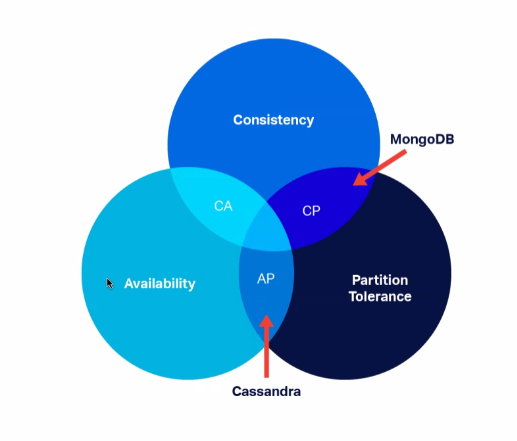
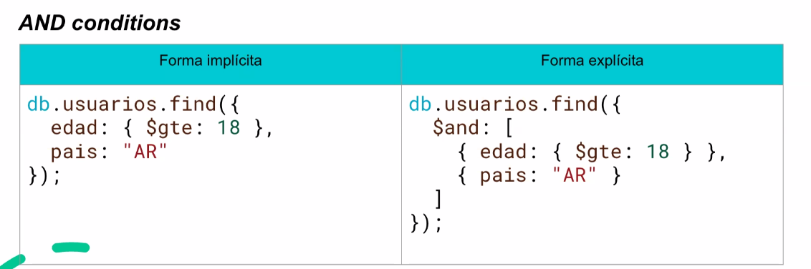
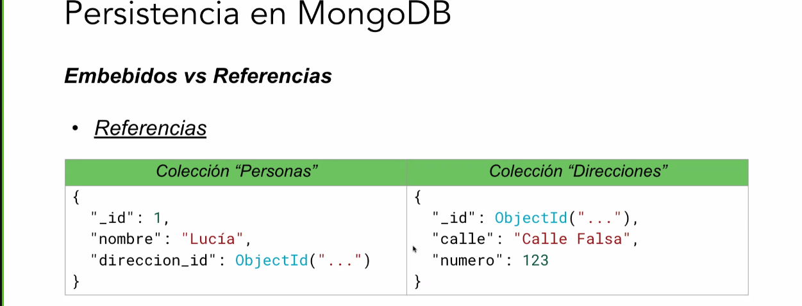
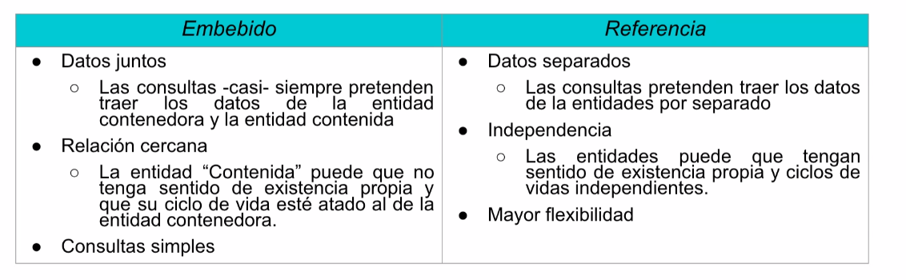
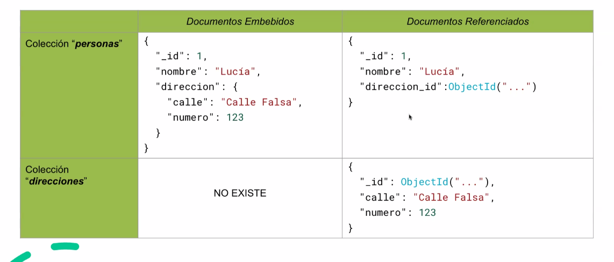

# Persistencia
- Persistencia en memoria
    - Desventajas : Inseguro, no tolera fallos, Poco eficiente
- Persistencia en archivos
- Persistencia en Base de datos
    - Ventajas: Acceso concurrente controlado, Seguridad y recuperación ante fallos, Búsqueda eficiente, Integridad y consistencia
- Persistencia en Objetos

---

# NoSQL
¿Qué es NoSQL?
* Conjunto de bases que no siguen estrictamente el modelo relacional.
* Priorizan escalabilidad, flexibilidad y velocidad frente a consistencia rígida.

(No: Not only) NO CONFUNDIR CON NO SQL

## Tipos
* Documentales
    * Muy flexibles: los documentos pueden tener estructuras distintas.
    * MongoDB, CouchDB, etc.
* Clave Valor
    * Muy rápidas y simples. Muy utilizado para Cachés, sesiones
    * Redis, DynamoDB, etc.
* Columnar
    * Optimizado para lecturas masivas y análisis de datos.
    * Cassandra, HBase, etc.
* Orientadas a Grafos
    * Muy potentes para buscar conexiones entre elementos.
    * Neo4j, ArangoDB, etc.


_Teorema de CAP_
* Consistencia
    * Todos ven los mismos datos al mismo tiempo
* Disponibilidad 
 * Siempre obtenemos una respuesta, existosa o no
* Partition tolerance
 * Los mensajes se pueden perder y/o los nodos pueden perder conectividad



---
# Persistencia en DBs Documentales
### ¿Cómo se guardan los datos?

* Los datos se guardan como Documentos (usualmente formato JSON)
* Sin esquema fijo (schema-less)
* Ejemplo: 
```javascript
{
    "nombre": "Juan",
    "edad" : 25,
    "hobbies" : ["fútbol", "lectura"]
}
```
### Terminología
* BD $\to$ Conjunto de colecciones
* Colección $\to$  Similar a una tabla, pero sin esquema.
* Documento $\to$  Similar a una fila, pero con estructura JSON.


### ¿Cuándo se recomienda utilizarlas?
- Cuando no hay relaciones complejas entre datos.
- Cuando se prioriza velocidad y escalabilidad.
- Cuando los datos tienen estructura semiestructurada o anidada.
- Cuando se necesita algo rápido


### ¿Qué es MongoDB?
- Es la base de datos documental más popular.
- No requiere esquema fijo (esquema flexible).
- Escalable horizontalmente (sharding).
- Soporta consultas complejas, índices, agregaciones.
- Recomendado para proyectos con estructuras de datos dinámicas o grandes volúmenes.


### Ventajas
* Adaptable a cambios rápidos en el modelo de datos.
* Buen rendimiento en lecturas/escrituras masivas.
* Integración natural con objetos en lenguajes como JavaScript.


# Identificadores de Documentos
- Mongo crea automáticamente un campo_id en cada documento si no se lo indicamos
- El tipo de dato por defecto es Objectid (un tipo especial de BSON).
- No es UUID, pero cumple una función similar.
- Un ObjectId es un identificador de 12 bytes:
    - 4 bytes: timestamp (fecha de creación)
    - 5 bytes: identificador único del host
    - 3 bytes: contador aleatorio


---
# Operaciones

Insert 
```javascript 

// Insertar un único elemento
db.usuarios.insertOne({
    nombre: "Carlos",
    edad: 28
});


// Insertar más de un elemento
const moviesToInsert = [
{title: "Arsenic and Old Lace", genres: ["Comedy", "Romance"], year: 1944 },
{title: "Ball of Fire", genres: ["Romance"], year: 1941},
{title: "I Married a Witch", genres: [ "Comedy"), year: 1942, }, 1;
const options = { ordered: true };
const result await movies.insertMany (moviesToInsert, options);
```
Find (búsquedas)
```javascript
db.usuarios.findOne({...});
db.usuarios.find();//SIN CONDICIONES
db.usuarios.find({ edad: { $gte: 25 } }); // greater than or equal
db.usuarios.find({ edad: { $gt: 18, $lt: 35 } }); //greater than and lower than
db.usuarios.find({ nombre: /car/i});// Regex
```

AND (conditions)



---
Find por ObjectID 
* Correcto
```javascript
const { ObjectId } = require('mongodb');
db.usuarios.findOne({ _id: new ObjectId("507f1f77bcf86cd799439011") });
```
* Incorrecto
```javascript
db.usuarios.findOne({ _id: "507f1f77bcf86cd799439011" });
```


# Find - Operadores comparadores
```javascript
$eq: Igual a un valor. { edad: { $eq: 25}}
$ne: Distinto de un valor. { edad: {$ne: 18}}
$gt: Mayor que. { edad: { $gt: 18}}
$gte: Mayor o igual que. { edad: { $gte: 18}}
$lt: Menor que. { edad: {$lt: 65}}
$lte: Menor o igual que. {edad: { $lte: 30}}
$in: Está en una lista de valores. { pais: { $in: ["AR", "BR", "UY"] } }
$nin: No está en una lista de valores. { pais: { $nin: ["US", "UK"]}}
$exists: Verifica si el campo existe o no. { email: { $exists: true }}
$type: Filtra por tipo de dato BSON. { edad: { $type: "int"}}
$regex: Coincidencia con expresión regular. { nombre: { $regex: "^Lu", $options: "i" } }
```
Update
```javascript
db.usuarios.updateOne(
{ nombre: "Carlos" },
{ $set: { edad: 29 } }
);
```

Delete 
```javascript
db.usuarios.deleteOne({ nombre: "Carlos" });

CUIDADO CON USAR DELETE porque elimina todos los documentos

```

Sort & Limit (orden y límite)
```javascript

//Ordena de mayor a menor 
db.usuarios.find().sort({edad: -1}).limit(5)

//Esto es resuelto por la BD
```

---


<b>Embebidos vs Referencias </b>

Documentos Embebidos
* ¿Qué implica? Incluir un documento dentro de otro como un campo.
* ¿Cuándo conviene?
    * Hay una relación "uno a pocos" (oneToAFew)
    * Los datos siempre se consultan juntos
    * El tamaño no crece mucho

Embebidos :

```javascript
{
    "_id": 1,
    "nombre": "Lucia"
    "direccion" : {
        "calle" : "Sarmiento",
        "altura": 123
    }
}
```








Proyecciones
La proyección permite seleccionar qué campos mostrar u ocultar.
```javascript
    db.usuarios.find({},{nombre: 1, _id: 0 });
```

* {} $\to$ Sin filtro, trae todos.
* {nombre: 1, _id:0} $\to$ solo muestra el campo nombre, id

