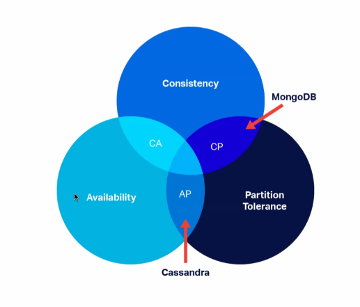
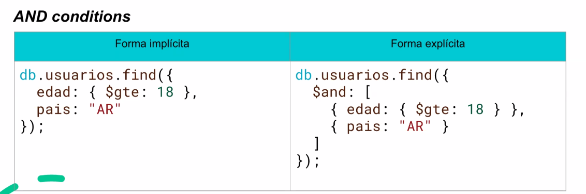
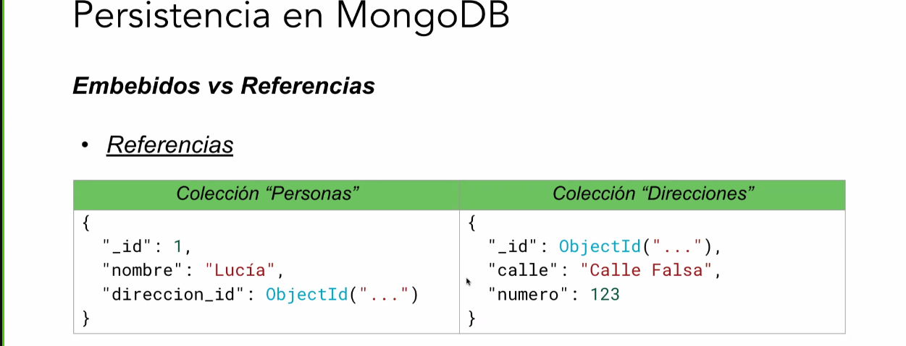
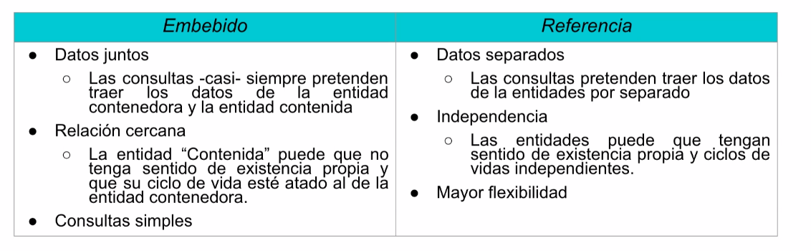

# Persistencia

En términos informáticos, la persistencia se refiere a que el estado de un sistema sobrevive más allá del proceso que lo creó; es decir, más allá de una única ejecución.  
Esto se logra almacenando ese estado en medios persistentes como bases de datos o archivos.

| Tipo de Persistencia     | Ventajas                                                                 | Desventajas                                                                 | Uso Real                                                                                  |
|--------------------------|--------------------------------------------------------------------------|------------------------------------------------------------------------------|-------------------------------------------------------------------------------------------|
| 🧠 **En memoria**         | ⚡ Muy rápido acceso, ideal para procesamiento temporal y cache o para **tests**          | ❌ Inseguro, no tolera fallos, no durable en el tiempo                        | 🗃️ Cache con **Redis**, sesión en memoria en web apps con `express-session`              |
| 📄 **En archivos**        | ✅ Fácil de implementar, portable, sin necesidad de software adicional     | 🐌 Manejo de concurrencia complejo, búsquedas lentas, riesgo de corrupción   | 📁 Archivos `.json`, `.csv`, logs, configuraciones, juegos que guardan progreso local     |
| 🗄️ **En base de datos**   | 🔐 Acceso concurrente, integridad, recuperación ante fallos               | ⚙️ Mayor complejidad, requiere mantenimiento, dependencia externa            | 🧾 Apps empresariales con **PostgreSQL**, **MySQL**, **MongoDB**, **Oracle**              |
| 🧱 **En objetos**          | 🔄 Mapeo natural con objetos del dominio, mantiene relaciones              | ⚠️ Dificultad con BDs relacionales, versionado, rendimiento                  | 🧬 Serialización (`Java Serializable`, `Python pickle`), ORMs como **Hibernate**, **EF**  |

# Clasificación de Bases de datos
## Bases de Datos Relacionales (SQL)

*   **Almacenamiento:** Datos en **tablas** con **esquemas rígidos** y bien definidos, siguiendo el modelo relacional.
*   **Ejemplos:** MySQL, PostgreSQL, Oracle, SQL Server.
*   **En la Carrera:** Se profundizarán en la materia "Base de Datos / Gestión de Datos" y se usarán con ORMs en "Diseño de Sistemas".

## Bases de Datos Orientadas a Objetos
*   **Características:** Persisten objetos tal como están en el código, soportando herencia, encapsulamiento y otros conceptos del paradigma orientado a objetos.
*   **Limitación:** Están **atadas a un lenguaje de programación particular**, lo que afecta la interoperabilidad entre sistemas que usan diferentes lenguajes.
*   **Ventaja:** Son muy **veloces** porque no hay transformación entre el objeto en memoria y el objeto guardado en la base.
*   **Uso Típico:** Entornos muy acoplados al paradigma de objetos o sistemas embebidos, como juegos de escritorio. Son 
menos comunes.

## Bases de Datos NoSQL (Not only SQL)
* Conjunto de bases que no siguen estrictamente el modelo relacional.
* Mucho más **flexibles**, pensadas para **grandes volúmenes de datos** y **estructuras no tabulares/semiestructuradas**. Priorizan la **escalabilidad** y la **velocidad** frente a la consistencia rígida.
* Facilitan la **escalada horizontal** (añadir más servidores) para manejar más usuarios concurrentes, a diferencia de las relacionales que son más difíciles de escalar horizontalmente. Las NoSQL pueden replicar datos de forma asíncrona para priorizar la disponibilidad.


### Tipos de BD NoSQL
* **Documentales**
    * Muy flexibles: los documentos pueden tener estructuras distintas.
    * MongoDB, CouchDB, etc.
* **Clave Valor**
    * Muy rápidas y simples. Muy utilizado para Cachés, sesiones
    * Redis, DynamoDB, etc.
* **Columnares**
    * Optimizado para lecturas masivas y análisis de datos.
    * Cassandra, HBase, etc.
* **Orientadas a Grafos**
    * Muy potentes para buscar conexiones entre elementos.
    * Neo4j, ArangoDB, etc.
---

## Teorema de CAP (Consistencia, Disponibilidad, Tolerancia a Particiones)
Este teorema plantea que ninguna base de datos puede garantizar las tres a la vez, solo dos de ellas.
*   **Consistencia (C):** Todos los clientes ven los mismos datos al mismo tiempo.
*   **Disponibilidad (A):** Siempre se obtiene una respuesta (exitosa o no).
*   **Tolerancia a Particiones (P):** El sistema sigue funcionando aunque haya fallos de conectividad entre nodos.


*   **MongoDB** garantiza **Consistencia (C)** y **Tolerancia a Particiones (P)**, pero no disponibilidad.
*   **Cassandra** garantiza **Disponibilidad (A)** y **Tolerancia a Particiones (P)**.
---
# Persistencia en DBs Documentales
### ¿Cómo se guardan los datos?

* Los datos se guardan como Documentos (usualmente formato JSON)
* Sin esquema fijo (schema-less)
* Ejemplo: 
```javascript
{
    "nombre": "Juan",
    "edad" : 25,
    "hobbies" : ["fútbol", "lectura"]
}
```
### Terminología
* BD $\to$ Conjunto de colecciones
* Colección $\to$  Similar a una tabla, pero sin esquema.
* Documento $\to$  Similar a una fila, pero con estructura JSON.


### ¿Cuándo se recomienda utilizarlas?
- Cuando no hay relaciones complejas entre datos.
- Cuando se prioriza velocidad y escalabilidad.
- Cuando los datos tienen estructura semiestructurada o anidada.
- Cuando se necesita salir muy rápido a producción con una aplicación.


### ¿Qué es MongoDB?
- Es la base de datos documental más popular.
- No requiere esquema fijo (esquema flexible).
- Escalable horizontalmente (sharding).
- Soporta consultas complejas, índices, agregaciones.
- Recomendado para proyectos con estructuras de datos dinámicas o grandes volúmenes.
-   Tiene una **integración natural con objetos en lenguajes como JavaScript/TypeScript**, ya que sus documentos se guardan en formato **JSON**. Esto facilita el desarrollo rápido.


### Ventajas
* Adaptable a cambios rápidos en el modelo de datos.
* Buen rendimiento en lecturas/escrituras masivas.
* Integración natural con objetos en lenguajes como JavaScript.


# Identificadores de Documentos
- Todos los documentos en MongoDB **deben tener un campo `_id`**.
- Si no se especifica, MongoDB crea automáticamente un campo `_id` de tipo **`ObjectId`**.
- El tipo de dato por defecto es Objectid (un tipo especial de BSON).
- No es UUID, pero cumple una función similar.
- **Ventaja de UU IDs/ObjectIds:** Son aleatorios y largos (ej., 32 o 64 caracteres), lo que hace **casi imposible adivinar otros IDs** por enumeración. Esto es una medida de seguridad importante cuando se manipulan entidades públicamente (ej., en URLs).
- Un ObjectId de mongoDB, lo genera automáticamente Mongo y no es autoincremental, es un identificador de 12 bytes:
    - 4 bytes: timestamp (fecha de creación)
    - 5 bytes: identificador único del host
    - 3 bytes: contador aleatorio
-   **`Pretty roots`** (rutas "bonitas"): Permiten usar alias más legibles en las URLs para recursos que internamente se identifican con UUIDs largos, lo que mejora la experiencia del usuario y proporciona contexto (ej., en diarios online o Wikipedia).


---
# Operaciones

Insert 
```javascript 

// Insertar un único elemento
db.usuarios.insertOne({
    nombre: "Carlos",
    edad: 28
});


// Insertar más de un elemento
const moviesToInsert = [
{title: "Arsenic and Old Lace", genres: ["Comedy", "Romance"], year: 1944 },
{title: "Ball of Fire", genres: ["Romance"], year: 1941},
{title: "I Married a Witch", genres: [ "Comedy"), year: 1942, }, 1;
const options = { ordered: true };
const result await movies.insertMany (moviesToInsert, options);
```
## Find (búsquedas)
```javascript
db.usuarios.findOne({...});
db.usuarios.find();//SIN CONDICIONES
db.usuarios.find({ edad: { $gte: 25 } }); // greater than or equal
db.usuarios.find({ edad: { $gt: 18, $lt: 35 } }); //greater than and lower than
db.usuarios.find({ nombre: /car/i});// Regex
```

AND (conditions)



---
## Find por ObjectID 
* Correcto
```javascript
const { ObjectId } = require('mongodb');
db.usuarios.findOne({ _id: new ObjectId("507f1f77bcf86cd799439011") });
```
* Incorrecto
```javascript
db.usuarios.findOne({ _id: "507f1f77bcf86cd799439011" });
```


## Find - Operadores comparadores
*   `$eq`: Igual a.
*   `$ne`: No igual a.
*   `$gt`: Mayor que (greater than).
*   `$gte`: Mayor o igual que (greater than or equal).
*   `$lt`: Menor que (less than).
*   `$lte`: Menor o igual que (less than or equal).
*   `$in`: Dentro de una lista de valores (colección/array).
*   `$nin`: No dentro de una lista de valores.
*   `$exists`: Si un campo existe o no.
*   `$type`: Filtra por tipo de dato BSON (ej. `integer`, `string`).
*   `$regex`: Coincidencia por expresión regular.
*   **Nota importante:** Para buscar por `_id`, se debe usar `new Object ID()` y no pasarlo directamente como un string.


## Update
```javascript
db.usuarios.updateOne(
{ nombre: "Carlos" },
{ $set: { edad: 29 } }
);
```

## Delete 
```javascript
db.usuarios.deleteOne({ nombre: "Carlos" });

CUIDADO CON USAR DELETE porque elimina todos los documentos

```

## Sort & Limit (orden y límite)
```javascript

//Ordena de mayor a menor 
db.usuarios.find().sort({edad: -1}).limit(5)

//Esto es resuelto por la BD
```

---


## Embebidos vs Referencias

Documentos Embebidos
* ¿Qué implica? Incluir un documento dentro de otro como un campo.
* ¿Cuándo conviene?
    * Hay una relación "uno a pocos" (oneToAFew)
    * Los datos siempre se consultan juntos
    * El tamaño no crece mucho

Embebidos :

```javascript
{
    "_id": 1,
    "nombre": "Lucia"
    "direccion" : {
        "calle" : "Sarmiento",
        "altura": 123
    }
}
```






### Proyecciones
La proyección permite seleccionar qué campos mostrar u ocultar.
```javascript
    db.usuarios.find({},{nombre: 1, _id: 0 });
```

* {} → Sin filtro, trae todos.
* {nombre: 1, _id:0} → solo muestra el campo nombre, ocultando el campo `_id`.
*   Permite **seleccionar qué campos mostrar u ocultar** en los resultados de una búsqueda, usando `1` para mostrar y `0` para ocultar. Útil para distintos roles de usuario.

## Agregaciones
* Un sistema poderoso por etapas (pipeline), similar a `GROUP BY`, `SUM`, `HAVING` en SQL. Trabajan en pasos secuenciales.
    *   **Utilidad:** Permiten realizar operaciones más complejas que `find`, como agrupamientos, cálculos, y la **unión de documentos referenciados**.
    *   **Operadores/Etapas Comunes:**
        *   **`$match`:** Filtra documentos (similar a `WHERE`).
        *   **`$lookup`:** Realiza "joins" entre colecciones, uniendo documentos de una colección con los de otra basándose en un campo común (como una foreign key).
        *   **`$unwind`:** Descompone un array en documentos separados, o extrae un único elemento de un array de un solo elemento.
        *   **`$group`:** Agrupa documentos y puede calcular valores (ej. `count`, `sum`).
        *   También se pueden usar `$sort`, `$project`, `$limit`, `$skip` como etapas de agregación.
    *   **Find vs. Agregados:** `find` es para búsquedas simples con condiciones (and, or), mientras que los agregados se usan para **agrupamientos, conteos, y para traer documentos referenciados completos**.

```javascript
db.users.aggregate([
    {
        $lookup: {
            from: "direcciones",       // Colección a la que se hace referencia
            localField: "direccionId", // Campo en la colección 'users'
            foreignField: "_id",       // Campo en la colección 'direcciones'
            as: "direccion"            // Nombre del nuevo campo que contendrá el documento de dirección
        }
    },
    {
        $unwind: "$direccion" // Descompone el array 'direccion' si hay un único elemento
    }
])

```

## Object Document Mapper (ODM) - Mongoose
*   **¿Qué es un ODM?**
    *   **Object Document Mapper:** Herramienta que **mapea objetos JavaScript a documentos de MongoDB**.
    *   Proporciona una interfaz orientada a objetos para interactuar con la base de datos.
    *   Ayuda a **validar, estructurar y manipular los datos** de forma más sencilla.
    *   **Diferencia con ORM:** Similar a un ORM (Object-Relational Mapper) pero para bases de datos documentales en lugar de relacionales.
*   **¿Por qué usar un ODM?**
    *   Ayuda a definir **esquemas de base de datos**.
    *   Maneja **relaciones y validaciones** de forma más sencilla que las agregaciones manuales.
    *   **Evita escribir queries de Mongo a mano** constantemente.
    *   Permite usar métodos personalizados y *middlewares*.
*   **Mongoose:**
    *   Es el ODM que se utilizará para Node.js. Se instala con `npm install mongoose`.
    *   **Configuración Básica:** Conexión simple con `mongoose.connect()`.
*   **Persistir y Recuperar Objetos con Mongoose:**
    *   **1. Definir un Esquema:** Se define la estructura y tipos de datos de los atributos del documento (ej. `nombre: String`, `edad: Number`) usando `new mongoose.Schema()`.
    *   **2. Asociar el Esquema a la Clase de Dominio:** Se usa `.loadClass()` para vincular el esquema con la clase de JavaScript (ej. `usuarioEsquema.loadClass(UsuarioClase)`).
    *   **3. Crear un Modelo:** Se crea un modelo usando `mongoose.model()`, que representa la colección en la base de datos (ej. `const UsuarioModel = mongoose.model('Usuario', usuarioEsquema)`). El primer parámetro es el nombre de la colección.
    *   **Guardar (`save`):** Se instancia el modelo (ej. `new UsuarioModel({ nombre: 'Lucia', edad: 30 })`) y se llama a su método **`.save()`** para insertarlo en la base de datos. Es mucho más sencillo que el `insertOne` manual.
    *   **Recuperar (`find`):** Se usan métodos como **`UsuarioModel.findOne()`** o **`UsuarioModel.find()`** y se les pasan las condiciones. La gran ventaja es que Mongoose **devuelve directamente instancias de tu clase de dominio**, manejando el mapeo automáticamente.
*   **Manejo de Relaciones con ODM:**
    *   **Objetos Embebidos (con Mongoose):**
        *   Se definen directamente en el esquema de la entidad contenedora como un array o un objeto de otro esquema (ej. `posts: [PostEsquema]`).
        *   El ODM los **carga automáticamente** (carga ansiosa), sin necesidad de funciones de agregación. Es la forma más sencilla.
    *   **Objetos Referenciados (con Mongoose):**
        *   En el esquema, se define el campo de referencia usando `Schema.Types.ObjectId` y especificando la colección referenciada con `ref` (ej. `autor: { type: Schema.Types.ObjectId, ref: 'Usuario' }`).
        *   Para "hidratar" los atributos referenciados (convertir los IDs en objetos completos), se debe llamar **explícitamente** al método **`.populate()`** en la consulta (ej. `UsuarioModel.findOne().populate('posts')`).
        *   Si un esquema tiene varias referencias, se deben usar **varios `.populate()`**.
*   **Conclusión del ODM:** Simplifica enormemente la interacción con MongoDB, abstrayendo las complejas queries de agregación y permitiendo trabajar con objetos de dominio directamente.