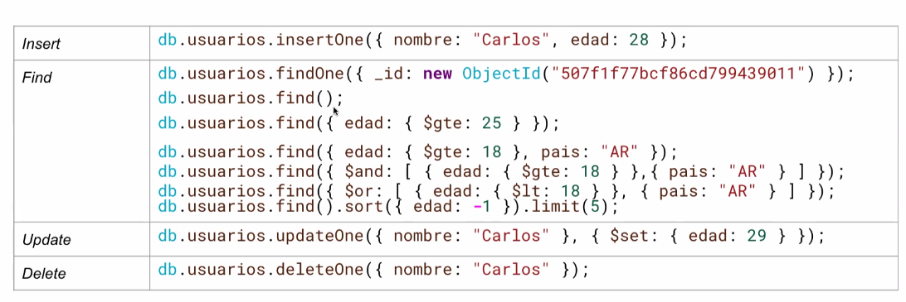

Vamos a estar trabajando con la persistencia de datos con mongo DB

###### Persistencia 
- La persistencia se refiere a que el estado de un Sistema sobrevive más allá de una única ejecución
- Esto se logra, en la práctica, almacenando dicho estado en archivos o en una Base de datos


###### Documentos de MONGODB


###### Operaciones CRUD básicas



$\color{lightblue} \text {eq}$: Igual a un valor. { edad: { $eq: 25}}

$\color{lightblue} \text {ne}$: Distinto de un valor. { edad: {$ne: 18}}

$\color{lightblue} \text {gt}$: Mayor que. { edad: {$gt: 18}}

$\color{lightblue} \text {gte}$: Mayor o igual que. { edad: { $gte: 18}}

$\color{lightblue} \text {lt}$: Menor que. {edad: {$lt: 65}}

$\color{lightblue} \text {Ite}$: Menor o igual que. {edad: { $lte: 30}}

$\color{lightblue} \text {in}$: Está en una lista de valores. {pais: {$in: ["AR", "BR", "UY"] }}

$\color{lightblue} \text {nin}$: No está en una lista de valores. {pais: { $nin: ["US", "UK"] } }

$\color{lightblue} \text {exists}$: Verifica si el campo existe o no. { email: { $exists: true } } 

$\color{lightblue} \text {type}$: Filtra por tipo de dato BSON. { edad: { $type: "int"}}

$\color{lightblue} \text {regex}$: Coincidencia con expresión regular. { nombre: { $regex: "^Lu", $options: "i" } }


###### ODM - Mongoose

* Un ODM (Object Document Mapper) es una herramienta que permite :
    * Mapear objetos JavaScript a documentos MongoDB.
    * Usar una interfaz orientada a objetos para interactuar con la base
    * Validar, estructurar y manipular los datos más fácilmente

**Por qué usar ODM ?**

* Define esquema de datos
* Maneja relaciones y validaciones 
* Evita escribir queries Mongo "a mano" todo el tiempo
* Permite usar métodos personalizados, middleware, etc.


# Mongoose
```bash
npm install mongoose --save
```

