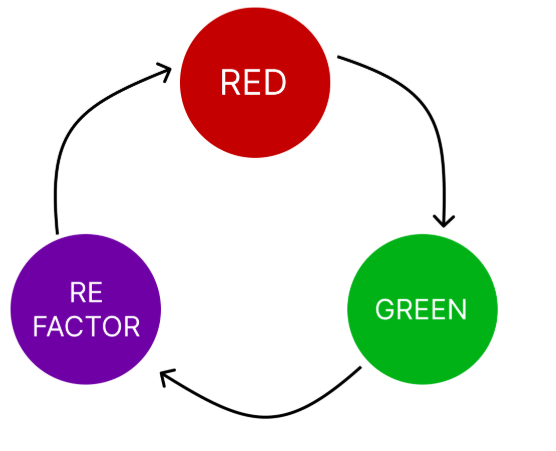

Aquí tienes un resumen basado en la presentación sobre TDD (Test Driven Development):

La presentación se centra en **Test Driven Development (TDD)**, una **metodología de desarrollo de software** que prioriza la escritura de pruebas antes que el código funcional.

### Conceptos Clave de TDD

*   **Ciclo Red-Green-Refactor**: TDD se basa en un ciclo iterativo de tres pasos:
    1.  **Red (Rojo)**: Escribir una **prueba que falle** porque la funcionalidad aún no existe o no es correcta.
    2.  **Green (Verde)**: Escribir el **código mínimo** necesario para que la prueba pase, siguiendo el principio KISS (Keep It Simple, Stupid).
    3.  **Refactor (Refactorizar)**: Una vez que la prueba pasa, **optimizar y limpiar el código** sin cambiar su comportamiento, asegurando que todas las pruebas sigan pasando.

*   **Pasos de la Metodología**: Los pasos se resumen como:
    1.  Prueba que falle.
    2.  Código mínimo (KISS).
    3.  Optimización.

*   **Algunas consideraciones**: Se recomienda tener un **repositorio único de pruebas**, utilizar la **integración continua**, asegurar la **compatibilidad con el sistema completo** y **corregir errores menores primero**.

### Diferencias con otras metodologías

La presentación compara TDD con **BDD (Behavior-Driven Development)** y el **Modelo Cascada** (Clásico):

| Característica            | TDD                                    | BDD                                                               | Cascada (Modelo Clásico)                                    |
| :------------------------ | :------------------------------------- | :---------------------------------------------------------------- | :---------------------------------------------------------- |
| **Enfoque**               | **Pruebas**.                       | **Comportamiento esperado**.                                  | **Secuencial**.                                         |
| **Orden del desarrollo**  | 1. Escribir pruebas, 2. Codificar, 3. Refactorizar. | 1. Definir comportamientos, 2. Escribir escenarios, 3. Codificar, 4. Pruebas. | 1. Requisitos, 2. Diseño, 3. Desarrollo, 4. Pruebas. |
| **Participación del usuario** | **Limitada**.                      | **Alta**.                                                     | **Alta al inicio**, baja durante el desarrollo.         |
| **Tipo de pruebas**       | **Unitarias, automatizadas**.      | **Escenarios de usuario, pruebas de aceptación automatizadas**. | Manuales o automatizadas **al final del proceso**.      |
| **Objetivo principal**    | **Validar el código con precisión técnica**. | **Validar el comportamiento desde la perspectiva del usuario**. | **Cumplir con requisitos definidos al principio**.      |
| **Adaptabilidad al cambio** | **Alta**.                          | **Alta**.                                                     | **Baja**.                                               |
| **Uso en metodologías ágiles** | **Muy común**.                     | **Muy común**.                                                | **No es ágil**.                                         |
| **Documentación**         | **Generada a partir de las pruebas**. | Documentación para negocio y técnica.                         | Documentación detallada.                                |

Un ejemplo real compara cómo un chef prepararía una receta usando cada enfoque:

*   **Cascada**: Menú → Comprar ingredientes → Cocinar → Servir.
*   **TDD**: Receta → Cocinar → Ajustar (implica crear una expectativa/prueba y luego cumplirla).
*   **BDD**: Charlar con clientes → Receta → Cocinar → Ajustar (foco en el comportamiento deseado por el cliente).

### Casos de Uso y Consideraciones de TDD

*   **¿Por qué usar TDD?**
    *   **Calidad en el código**.
    *   **Mantenibilidad**.
    *   **Adaptabilidad al cambio**.
    *   **Confianza en el desarrollo**.
    *   **Documentación viva**.

*   **¿Cuándo sí usar TDD?**
    *   Cuando la **calidad en el código es crítica**.
    *   Para el desarrollo de **bibliotecas**.
    *   En **equipos con cambios constantes**.

*   **¿Cuándo no usar TDD?**
    *   En **proyectos pequeños**.
    *   Cuando se requieren **cambios rápidos**.
    *   Para la creación de **prototipos**.

*   **Ventajas de TDD**:
    *   **Reducción de bugs**.
    *   Las **pruebas sirven como documentación**.
    *   **Refactorización segura**.
    *   Mayor **confianza en el desarrollo**.
    *   Fomenta un **diseño modular**.

*   **Desventajas de TDD**:
    *   **Curva de aprendizaje** para el equipo.
    *   Requiere un **tiempo inicial** adicional.
    *   Posibilidad de un **diseño de tests erróneo**.
    *   **Dependencia de herramientas** de testing.
    *   Necesidad de un **análisis del equipo** para su implementación.

### Prácticas y Patrones en TDD

*   **Mejores prácticas**:
    *   Escribir **pruebas pequeñas y aisladas**.
    *   **Diseñar los tests de manera adecuada**.
    *   Fomentar la **refactorización continua**.
    *   Utilizar una **nomenclatura entendible** para las pruebas.
    *   Asegurar la **capacitación del personal**.

*   **Given-When-Then**: Es un patrón para estructurar las pruebas, haciendo que sean claras y legibles:
    *   **Given**: Define el estado inicial o contexto.
    *   **When**: Describe la acción que se realiza.
    *   **Then**: Verifica el resultado esperado.
    *   Ejemplo: `Given: Producto producto = new Producto("Manzana", 100); When: producto.aplicarDescuento(10); Then: assert(90, producto.getPrecio());`.

*   **Test Doubles**: Son objetos que reemplazan a los objetos reales en los tests para controlar el entorno y aislar las pruebas.
    *   **Mocks**: **Reemplazan funciones y registran su uso**. **Simulan el comportamiento de dependencias** para verificar interacciones. Un ejemplo con Jest muestra cómo `jest.fn()` crea una función simulada para verificar si fue llamada y con qué argumentos.
    *   **Stubs**: Proporcionan **respuestas predefinidas** para llamadas a funciones, permitiendo **controlar el entorno** del test sin invocar la lógica real de las dependencias. Un ejemplo con Jest ilustra cómo `mockReturnValue` define un valor de retorno fijo para una función simulada.

### Actividad Práctica - MegaSúper

La presentación concluye con una actividad práctica llamada "MegaSúper", que involucra el desarrollo de un sistema de carrito de compras. Las características principales son:

*   **Productos**: Tienen nombre, categoría, precio base y descuentos opcionales (porcentaje, monto fijo, 3x2).
*   **Carrito de Compras**: Permite a los usuarios agregar productos en la cantidad que deseen y el sistema debe calcular el total aplicando los descuentos.
*   **Funciones del Sistema**: Agregar productos al carrito y calcular el total.

La **Actividad Extra** propone la creación de un **nuevo tipo de descuento**: un descuento que **solo se aplica si el total del carrito supera un monto mínimo específico**. Esta nueva funcionalidad debe implementarse utilizando el ciclo **Red, Green y Refactor de TDD**.