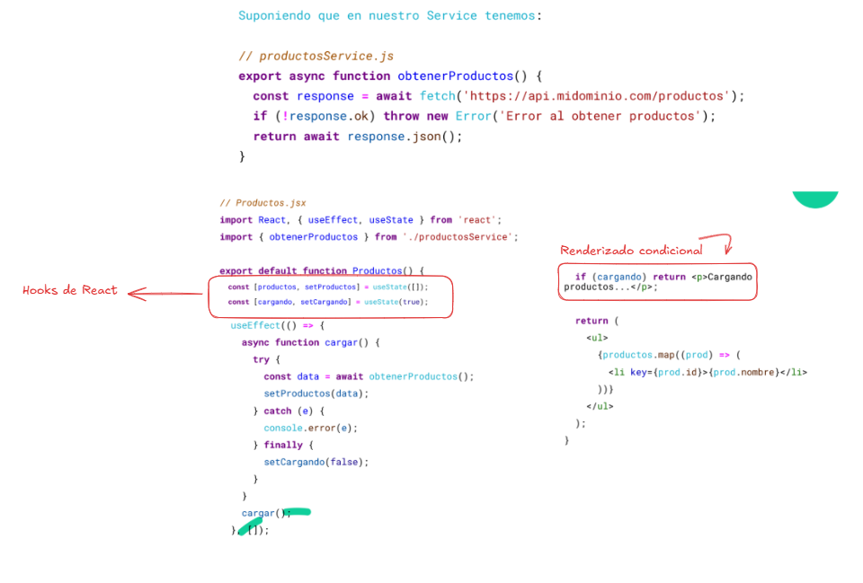
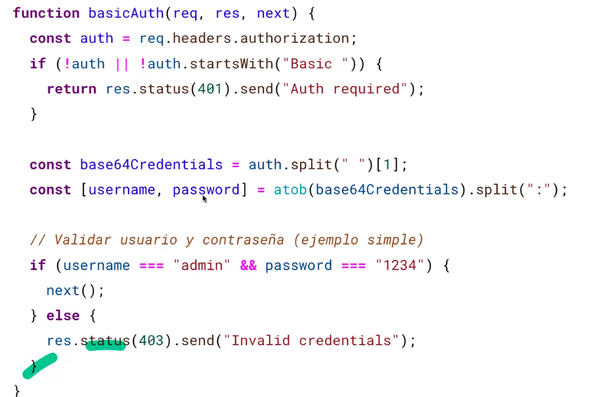

La clase se centró en la **integración de frontend y backend**, abordando temas clave como la **sincronización** entre ellos y el **manejo de usuarios**.

Aquí un resumen detallado de los puntos principales:

### Integración Front-Back
1.  **Contexto y Componentes**:
    *   La asignatura comenzó con la definición arquitectónica de sistemas, viendo diferentes tipos de arquitecturas y componentes.
    *   Se trabajó en el **backend**, resolviendo casos de uso en distintas capas, entendiendo la persistencia, implementando bases de datos NoSQL (documental), y estructurando en controladores, servicios y entidades de dominio. El backend expone una **API Rest**.
    *   Luego se pasó al **frontend**, donde se entendió qué es la UI, sus tipos y se trabajó en una arquitectura web, incluyendo conceptos de cliente-servidor y el protocolo HTTP con sus códigos de estado.
    *   Actualmente, el frontend es un **cliente pesado (client render)** que ejecuta una aplicación JavaScript (React, luego Next.js) en el navegador.
2.  **Necesidad de Integración**:
    *   La integración permite que el frontend llame a toda la funcionalidad ya desarrollada en el backend.
    *   En la vida real, los equipos de front y back pueden trabajar en **paralelo**, acordando un **contrato o interfaz** de la API que el backend expondrá y el frontend consumirá. Esto permite al front ser más independiente de si el backend está levantado o no.
3.  **Eventos que Disparan Llamadas al Backend**:
    *   **Cargar una página**: Para obtener datos iniciales o del usuario actual.
    *   **Clic en un botón**: Enviar formularios, abrir modales (popups), o casi cualquier acción interactiva.
    *   **Cambiar el estado de algo**: Checkboxes, selects, campos condicionados en formularios (ej. verificar DNI/CUIT al tabular).
    *   **Paso del tiempo**: Para chequear notificaciones (en web; en mobile, las notificaciones pueden manejarse de forma diferente).
4.  **Dónde Realizar las Llamadas en el Frontend**:
    *   Es crucial aplicar **cualidades de diseño básicas** como la **cohesión y el acoplamiento**, y principios SOLID, especialmente el **Principio de Responsabilidad Única**.
    *   Se recomienda implementar las llamadas en archivos **`services` o `API`**, preferiblemente organizados con **un archivo por cada recurso** (ej. `users.api.js`, `products.service.js`).
    *   Dentro de estos archivos, se pueden diseñar como **funciones sueltas** (estilo funcional) o como **clases con métodos** por cada endpoint (estilo orientado a objetos).
5.  **Mocking (Simulación de Llamadas)**:
    *   Fundamental para que los equipos de frontend y backend trabajen de forma independiente y paralela.
    *   **Métodos de mocking**:
        *   **Archivos JSON locales**: 
            ```javascript 
            (fetch('/mock/users.json'))
            ```
        *   **Librerías avanzadas**: Como MSW (Mock Service Worker), muy potente y utilizada.
        *   **Funciones que devuelven promesas resueltas**: Una forma rudimentaria pero posible.
            ```javascript 
            // mock/userService.js
                export const getUserById = async ()=>{ 
                    return Promise.resolve({ 
                        id: 1, 
                        name: 'Juan', 
                        email: 'JuanPerez@mail.com'
                })
            ```
    *   La documentación de la API, como la generada con **Swagger**, es vital como guía para ambos equipos en etapas iniciales de los proyectos y facilita el mocking.
6.  **Experiencia de Usuario (UX) en la Integración**:
    *   El usuario necesita **saber qué está pasando en todo momento** para no pensar que el sistema se colgó.
    *   Si no se informa al usuario, intentará realizar la acción varias veces, lo que puede generar **inconsistencias** (registros duplicados, datos a medias).
    *   Solución: Siempre mostrar un **spinner (loader)** o un **skeleton** (pantalla de carga que simula la estructura del contenido) para indicar que algo está cargando.
    *   **Renderizado condicional**: En React, se puede mostrar un spinner si una variable `loading` es `true`, y el contenido cuando `loading` sea `false`.
7.  **Implementación con React Hooks**:
    *   **Hooks de React**: Funciones especiales que permiten a los componentes funcionales usar características de React como estado y efectos secundarios.
    *   **`useState`**: Hook para **manejar el estado** de una variable en un componente (ej. `[productos, setProductos] = useState([])`). Cada vez que se usa el "setter" (`setProductos`, ), el componente se **re-renderiza**.
    *   **`useEffect`**: Hook para ejecutar **efectos secundarios** (ej. llamadas a APIs, manipulación del DOM, timers). Se ejecuta **después del primer renderizado** del componente. Si tiene un array de dependencias vacío `[]`, se ejecuta solo una vez (al montar el componente). Si las dependencias cambian, se ejecuta de nuevo. Ej: `useEffect(() => { ... }, [dependencias]);`. -> **React Renderiza primero, luego ejecuta el efecto**.

    * **`useContext`**: Hook para acceder al **contexto de React**, que permite compartir datos entre componentes sin pasar props manualmente. Es útil para manejar el estado global de la aplicación (ej. usuario autenticado, configuración).(ej.)
    * **`customHooks`**: Funciones que encapsulan lógica reutilizable, como llamadas a APIs. Permiten separar la lógica de negocio de la UI y mejorar la legibilidad del código.
    *   **Ejemplo de código**: 
    
8.  **Librerías HTTP**:
    *   **Fetch**: Tradicional y muy usado en JavaScript plano y frameworks.
    *   **Axios**: Una librería muy popular para hacer llamadas al backend, ofreciendo más configuraciones y facilidades.
9.  **Estructura del Proyecto para TP**:
    *   Se recomienda crear dos carpetas en la raíz del repositorio: `server` (para el backend) y `client` (para el frontend).
10. **Librerías de Componentes UI**:
    *   Se menciona **ANT D** como ejemplo de una biblioteca de componentes pre-generados que pueden ser reutilizados (iconos, botones, layouts, navegación, formularios, date pickers, elementos de feedback como spinners, skeletons y modals) para mejorar la presentación del TP. Se enfatiza en entender el diseño de componentes antes de depender de IA para estilos.

### Cuestiones de Sincronismo
**Preguntas Clave**: 

1. ¿Las respuestas del backend son instantáneas? 

    No siempre son instantáneas. Pueden demorar por sobrecarga del servidor, lógica compleja y costosa, o una decisión de procesar la solicitud **asíncronamente**.

2. ¿Qué pasa si el backend procesa la solicitud más tarde o realiza un procesamiento pesado? 

    **Procesamiento Asíncrono**:

    *   Si el backend procesa una solicitud asíncronamente, generalmente devuelve un **ID de operación**.
    *   El frontend puede usar este ID para realizar **polling**: preguntar al backend cada ciertos segundos/minutos si la operación ya finalizó.
    *   El ID de operación se puede guardar en **`local storage`** (almacenamiento clave-valor en el navegador) o en el **State** (contexto de React).
    *   Las notificaciones en aplicaciones web se manejarán probablemente con un timer que consulta al backend periódicamente (`polling`).
        ```javascript
        useEffect(() => {
            const interval = setInterval(async () => {
                const res = await fetch(`/api/operation-status/${operationId}`);
                const data = await res.json();
                if (data.status === "completed") {
                    clearInterval(interval);
                    setResult(data.result);
                }
        }, 5000);

        return () => clearInterval(interval);
        }, []);
        ```
    *   Mientras HTTP clásico es cliente-inicia (pull), otras versiones de protocolo o tecnologías como **WebSockets** permitirían un mecanismo de "push" (servidor notifica al cliente).

3. ¿Qué sucede si hay mucha latencia? 
    **Latencia y Timeouts**:
    *   Mucha latencia (demora) puede causar un **timeout** (agotamiento del tiempo de espera), cerrando la conexión sin resultados.
    *   **Mecanismos de reintento**:
        *   Aumentar el tiempo de timeout (parche, no solución).
        *   Implementar reintentos **automáticos** (ej. con Axios en un bucle con delay).
        *   Ofrecer al usuario la opción de **reintentar manualmente** (con un icono reconocible).

        ```javascript
        import axios from 'axios';

        async function fetchConReintentos(url, reintentos = 3, delay = 1000) {
            for (let intento = 1; intento <= reintentos; intento++) {
                try {
                    const response = await axios.get(url, { timeout: 2000 });
                    return response.data;
                } catch (error) {
                    if (intento < reintentos) {
                        console.warn(`Intento ${intento} fallido. Reintentando en ${delay}ms..`);
                        await new Promise(res => setTimeout(res, delay));
                    } else {
                        throw new Error(`Fallaron los ${reintentos} intentos: ${error.message}`);
                    }
                }
            }
        }
        ```
4. ¿El usuario puede seguir usando el sistema durante la request?.

    **Interacción del Usuario durante las Solicitudes**:

    *   **Pantalla de libre navegación**: Permite al usuario moverse por el sistema durante una request.
    *   **Pantalla cautiva**: No permite al usuario salir o moverse a otra pantalla hasta que la acción termine (ej. checkout en e-commerce, pagos en billeteras virtuales).
    *   Las pantallas cautivas son necesarias cuando el **proceso de negocio es sincrónico**, incluso si las llamadas al backend son asíncronas, porque el usuario debe percibir una única secuencia de acción. Para el TP, la reserva de un alojamiento podría ser un ejemplo de pantalla cautiva.
--- 

## Manejo de Usuarios

1.  **Conceptos Fundamentales**:
    *   **Autenticación (`Quién sos`)**: Reconocer al usuario que está usando el sistema.
    *   **Autorización (`Qué podés hacer`)**: Determinar qué acciones puede realizar el usuario (manejo de roles, permisos).
    *   Para el TP, el manejo es simplificado con dos tipos de usuarios: **huéspedes** y **anfitriones**, con acciones bien diferenciadas.
2.  **Autenticación en APIs (Protocolo HTTP Stateless)**:
    *   HTTP es un protocolo sin estado (stateless), por lo que se deben enviar **credenciales en cada petición** para que el backend sepa quién realiza la solicitud.
    *   **Formas de autenticación**:
        *   **HTTP Basic Auth**: El cliente envía `username:password` **codificado en Base64** en el encabezado `Authorization`. Es simple, pero el password viaja en cada request (aunque codificado, puede ser decodificado) y se recomienda HTTPS.
        
        *   **Bearer Token (JWT - JSON Web Token)**:
            *   El usuario se **autentica una vez** (ej. login) y el servidor devuelve un **token firmado** (un string con contenido cifrado, generalmente con tres partes: header, payload, firma).
            *   Las siguientes peticiones incluyen este token en el encabezado `Authorization: Bearer <token>`.
            *   **Ventajas**: Es stateless (no mantiene sesiones en el servidor), contiene metadata útil (ID de usuario, rol en el payload), fácil de escalar, utilizable en microservicios. La **firma** asegura que el token no ha sido alterado.
            *   **Desventajas**: Si el token se compromete, da acceso total hasta que expire; su revocación es compleja (requiere blacklists).
        *   **Buenas prácticas**: Usar siempre HTTPS, **no guardar passwords en el frontend** (solo tokens), usar **expiración en los tokens**, implementar refresh tokens si se necesitan sesiones largas, **validar la firma y expiración** en cada request, **evitar datos sensibles en el payload** y **no incluir tokens en las URLs** (siempre en headers).
3.  **Ejemplo de Implementación de JWT (Backend)**:
    *   Se usa un middleware `verifyToken` para proteger rutas. Este middleware extrae el token del header `Authorization`, lo verifica con una clave secreta y decodifica el payload (que contiene el ID y username del usuario). Si el token es inválido o no proporcionado, devuelve un 401.
    *   El endpoint `/login` recibe username y password, los valida contra un usuario hardcodeado (con password hasheada usando `bcrypt`), y si son correctos, **firma y devuelve un JWT** con el ID y username del usuario, y una expiración (ej. 1 hora).
    *   Un endpoint protegido (`/products`) usa el middleware `verifyToken` para acceder al usuario autenticado (a través del `payload` del token) y devolver solo los productos asociados a ese usuario.
4.  **Manejo de Tokens en el Frontend**:
    *   Después de un login exitoso, el frontend debe **guardar el token** recibido del backend en **`local storage`**.
    *   En las siguientes requests al backend, el frontend debe **recuperar este token** del `local storage` y enviarlo en el header `Authorization`.
    *   Se menciona que idealmente el token debería estar **encriptado** al guardarse en `local storage` para mayor seguridad, no solo hasheado.
    *   Para el TP, se espera una implementación sencilla de login y manejo de tokens para identificar usuarios y proteger rutas.`

        | Característica            | Basic Auth                 | Bearer Token - JWT                 |
        | :------------------------ | :------------------------- | :--------------------------------- |
        | **Seguridad** | Baja si no hay HTTPS       | Alta si se maneja bien             |
        | **Almacenamiento en front** | No recomendado             | En localstorage o cookie           |
        | **Stateless** | Sí                         | Sí                                 |
        | **Requiere encriptación** | Sí                         | Sí                                 |
        | **Reutilizable en múltiples APIs** | No                         | Sí                                 |
        | **Revocación** | No                         | Difícil (blacklist opcional)       |

#### Buenas prácticas

* Usar HTTPS siempre
* No guardar passwords en front, solo el token
* Usar expiración corta en tokens
* Implementar refresh tokens si es necesario sesiones más largas
* Validar firma y expiración del JWT en cada request
* Evitar exponer datos sensibles en el payload del JWT
* Evitar tokens en URL (van al historial)