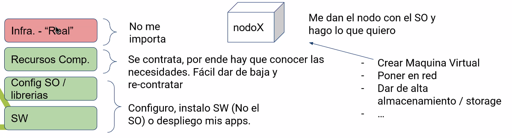
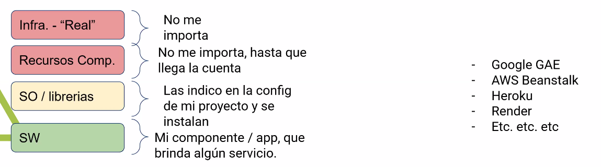
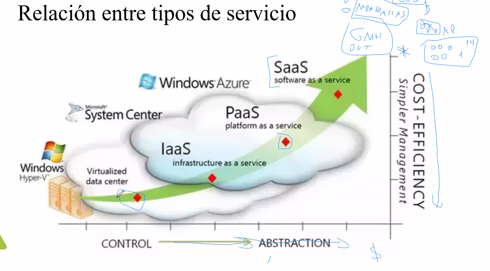
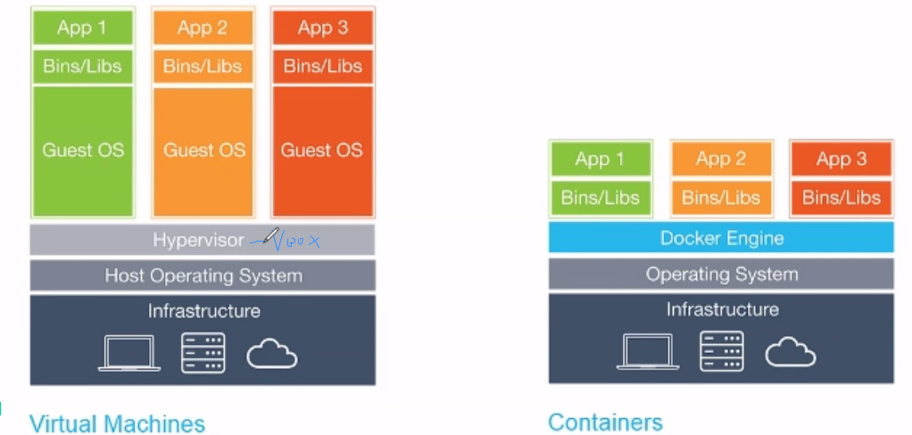
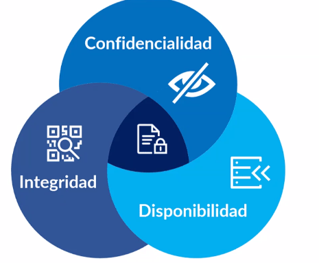
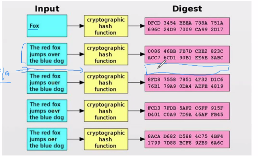

# Despliegue & Seguridad

#### Definición 
El `despliegue` se refiere al proceso de implementar, distribuir y poner en funcionamiento una aplicación, software, sistema o cualquier otro producto tecnológico en una infraestructura específica.

*  ¿Que necesitamos para que un sistema funcione? 
    * Software
    * Nodos de procesamiento
    * Red

# Definición de nube
**Cloud computing** es un modelo para permitir el acceso por la red de forma conveniente y bajo demanda a un conjunto compartido de recursos informáticos configurables (por ejemplo, redes, servidores, almacenamiento, aplicaciones y servicios) que pueden ser provisionados y liberados con un esfuerzo mínimo de gestión o interacción con el proveedor de servicios.

El modelo de cloud está compuesto por características esenciales, tres modelos de 
servicio y cuatro modelos de despliegue.

## ¿Donde está mi infraestructura? 
* Bare metal / Bajo mi mantenimiento
    * 💵Inversión inicial 
        * Es alta debido a la compra de hardware y software.
    * 🔧Mantenimiento Infraestructura y equipos 
        * Soy encargado de mantener la infraestructura, los equipos y el software.
* Nube privada 
    * 💵Tengo la infraestructura 
    * 💻La virtualizo
* Nube pública 
    * 🤝La alquilo/contrato la infra a un proveedor de servicios

--- 

# Tipos de servicios :
## Software as a Service (SaaS)
* La capacidad provista al usuario es usar aplicaciones del proveedor que se ejecutan en la nube.
* Las aplicaciones son accedidas desde varios tipos de dispositivos a través de clientes livianos como un Web Browser o aplicaciones de interface

... Falta completar

## Infrastructure as a Service (IaaS)
* La capacidad provista al cliente es proveer procesamiento, almacenamiento, red y otros recursos informáticos fundamentales donde el cliente puede desplegar y ejecutar software, que puede incluir sistemas operativos y aplicaciones.

* El cliente no gestiona o controla la infraestructura subyacente, pero tiene control sobre los sistemas operativos, almacenamiento, implementaciones de aplicaciones y posiblemente algunas configuraciones de red.

* El cliente pide por ejemplo : 
    * Un servidor virtual con 4 vCPU, 8GB de RAM y 100GB de disco.
    * Un balanceador de carga.
    * Un firewall.
    * Un sistema de almacenamiento.
* El proveedor de IaaS se encarga de la infraestructura física, la virtualización, el almacenamiento y la red.
* El cliente gestiona los sistemas operativos, las aplicaciones y la configuración de red.

## Platform as a Service (PaaS)
* La capacidad provista al clietne es desplegar sobre la infraestructura cloud aplicaciones del cluiente que fueron desarrolladas usando lenguajes de programación y heramientas soportadas por el proveedor.

* El cliente no gestiuona o controla la infraestructura subyacente, la red, los servidores, el sistema operativo o el almacenamiento, pero tiene control sobre las aplicaciones implementadas y posiblemente sobre la configuración del ambiente en que está ejecutandose.

* EL cliente pide por ejemplo : 
    * Un ambiente de desarrollo con un lenguaje de programación específico.
    * Un sistema de base de datos.
    * Un sistema de mensajería.

* El proveedor de PaaS se encarga de la infraestructura física, la virtualización, el almacenamiento, la red y el sistema operativo. 

## Vms vs contenedores

Una **máquina virtual** es una emulación de un sistema informático que proporciona la funcionalidad de un sistema físico. Permite ejecutar un sistema operativo y aplicaciones como si estuvieran en una máquina física, pero en realidad se ejecuta sobre un hipervisor que gestiona múltiples máquinas virtuales en un solo servidor físico.
Un **contenedor** es una unidad estándar de software que empaqueta el código y todas sus dependencias para que la aplicación se ejecute rápida y confiablemente en diferentes entornos de computación. Los contenedores comparten el mismo sistema operativo del host, lo que los hace más ligeros y eficientes en comparación con las máquinas virtuales, que requieren un sistema operativo completo por instancia.

---

# Seguridad

### Confidencialidad
La confidencialidad es la propiedad de la información que garantiza que solo las personas autorizadas tengan acceso a ella. En el contexto de la seguridad informática, implica proteger los datos contra accesos no autorizados, divulgación o exposición.

### Integridad
La integridad es la propiedad de la información que asegura que los datos no sean alterados, modificados o destruidos de manera no autorizada. Garantiza que la información se mantenga precisa y completa a lo largo del tiempo.

### Disponibilidad
La disponibilidad es la propiedad de la información que asegura que los datos y los sistemas estén accesibles y operativos cuando se necesiten. Implica garantizar que los recursos estén disponibles para los usuarios autorizados en el momento adecuado.

### Autenticacion
La autenticación es el proceso de verificar la identidad de un usuario, sistema o entidad antes de permitir el acceso a recursos o información. Es un paso crucial en la seguridad informática para garantizar que solo los usuarios autorizados puedan acceder a sistemas y datos sensibles.

### Autorizacion
La autorización es el proceso de otorgar permisos o privilegios a un usuario o entidad autenticada para acceder a recursos específicos o realizar acciones en un sistema. Después de que un usuario ha sido autenticado, la autorización determina qué recursos puede acceder y qué operaciones puede realizar.

### Auditoria
La auditoría es el proceso de revisar y evaluar las actividades, transacciones y eventos dentro de un sistema o red para garantizar el cumplimiento de políticas, normativas y estándares de seguridad. Implica registrar y analizar registros (logs) para identificar posibles violaciones de seguridad, fraudes o comportamientos no autorizados.

---
# Funciones criptográficas de hash

* Es una función deterministica que toma una entrada de tamaño arbitrario y produce una salida de tamaño fijo
* No es posible revertir la función para obtener la entrada original
* Es de cómputo rápido
* Minimiza colisiones (dos entradas diferentes producen el mismo hash)
* Ejemplo: SHA-256, SHA-512, MD5 (obsoleto)

> **¿Por qué MD5 está obsoleto?** 
 Debido a que se han encontrado vulnerabilidades que permiten colisiones, lo que significa que dos entradas diferentes pueden producir el mismo hash MD5, comprometiendo la integridad de los datos.

