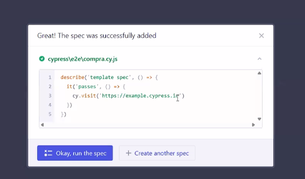

#### Repaso General

## Diferencia entre tipos de tests
- **Unit Tests**: Pruebas que verifican el comportamiento de una unidad específica del código, como una función o un método. Se centran en la lógica interna y no dependen de otros componentes.
- **Integration Tests**: Pruebas que verifican la interacción entre diferentes componentes del sistema
    y cómo se integran entre sí. Pueden incluir múltiples unidades y verificar que trabajen juntas correctamente.
- **End-to-End Tests**: Pruebas que simulan el comportamiento del usuario final y verifican que todo el sistema funcione como se espera. Estas pruebas suelen ser más lentas y abarcan todo el flujo de la aplicación.

### Errores comunes en pruebas E2E:
Tests que fallan aleatoriamente $\to$ Esperas explícitas, datos consistentes

Datos que cambian entre corridas $\to$ Usar fixtures o mocks

Tests lentos y difíciles de mantener $\to$ Automatizar sólo flujos críticos.

Pocas aserciones o poco significativas $\to$ Verificar resultados esperados

### Algunas herramientas para pruebas E2E:
- **Cypress**: Framework de pruebas E2E para aplicaciones web, fácil de usar y con una buena documentación.
- **Playwright**: Herramienta de pruebas E2E que permite interactuar con aplicaciones web en diferentes navegadores.
- **Selenium**: Framework de pruebas E2E que permite automatizar navegadores web y realizar pruebas en diferentes plataformas.
- **BrowserStack**: Plataforma que permite realizar pruebas E2E en diferentes navegadores y dispositivos móviles.


----
### Como escribir un test E2E con cypress
1. Instalar Cypress en tu proyecto:
   ```bash
   npm install cypress --save-dev
   ```
2. Abrir Cypress:
   ```bash
    npx cypress open
    ```
3. Creamos nuestro test


4. Escribir el test en el archivo creado:
   ```javascript
   describe('Mi primer test E2E', () => {
     it('Visita la página de inicio y verifica el título', () => {
       cy.visit('https://example.com');
       const sumarBuzo = cy.get('.carousel > div:nth-child(2) .item-footer-actions div button:nth-of-type(2)');
     });
   });
   ```