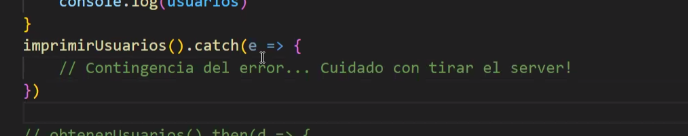

[26/04/2025]

Temas:

- Construcción de una API simple sin persistencia - Parte II.
- Incorporación de manejo de errores
- Asincronismo


En una tarea sincrónica las operaciones de I/O se realizan de manera bloqueante, es por ello que es necesario el uso de multihilos en caso de no querer bloqueos. En cambio una tarea asincronica podemos manejar esas operaciones concurrentes en un único hilo.


### Event Loop


El **event loop** es un **bucle que gestiona y despacha eventos o tareas que se deben ejecutar de forma asincrónica**, como:

* Timers (`setTimeout`, `setInterval`)
* Promesas (`.then()`, `async/await`)
* I/O (lectura de archivos, respuestas HTTP)
* Eventos del DOM (en browsers)

---

### 📦 ¿Dónde se usa típicamente?

* En **JavaScript**, que es single-threaded: no puede hacer múltiples tareas al mismo tiempo, así que usa el event loop para manejar tareas asincrónicas eficientemente.
* En **Node.js**, que usa el event loop para gestionar miles de conexiones sin bloquear el servidor.
* En navegadores, para responder a eventos de usuario y ejecutar callbacks en orden.

---

### 🌀 ¿Cómo funciona?

El flujo básico del event loop es:

1. **Stack**: Se ejecuta el código síncrono línea por línea.
2. **Web APIs / Workers**: Las operaciones asincrónicas (fetch, timers, I/O) se delegan al sistema.
3. **Callback Queue / Task Queue**: Cuando esas tareas terminan, sus callbacks se colocan en una cola.
4. **Event Loop**: Verifica si la stack está vacía. Si lo está, toma la siguiente tarea de la cola y la ejecuta.

🔄 Este ciclo se repite constantemente mientras corre el programa.

---

### 🧩 Ejemplo en JavaScript

```javascript
console.log('1');

setTimeout(() => {
  console.log('2');
}, 0);

console.log('3');
```

**Salida**:

```
1
3
2
```

‼️ Aunque `setTimeout` es 0 ms, el callback se pone en la cola, y solo se ejecuta cuando la stack esté vacía.

---

### ✅ Ventajas del Event Loop

| Ventaja            | Descripción                                                          |
| ------------------ | -------------------------------------------------------------------- |
| 🔄 No bloquea      | Puede seguir ejecutando mientras espera tareas I/O.                  |
| 🧵 Single-threaded | No necesita múltiples hilos para manejar concurrencia.               |
| ⚡ Eficiente        | Excelente para apps con muchas operaciones concurrentes (como APIs). |


### ⚠️ Limitaciones
* No es bueno para tareas **CPU-intensivas** (por ejemplo, procesamiento pesado de imágenes), ya que bloquea el hilo principal.
* Hay que tener cuidado de no saturar la event loop con operaciones síncronas largas.

---


### Callback
```js
    console.log("Esto está antes del llamado asíncrono.")

    setTimeout(
    () => {console.log ("Tarea asíncrona resuelta.")},3000)


    console.log("Esto está despues del llamado asíncrono.")

    //OUTPUT
    //Esto está antes del llamado asíncrono.
    //Esto está despues del llamado asíncrono.
    //Tarea asíncrona resuelta.

```

‼️Cuando tenemos que concatenar varias tareas asíncrona se puede dar algo como esto y deja de ser extensible

```js

setTimeout(
() => {
    console.log ("1. Tarea asíncrona resuelta.")
    setTimeout (()=>{
        console.log ("2. Tarea asíncrona resuelta.")
        setTimeout(()=>{
            console.log ("3. Tarea asíncrona resuelta."),3000      
        })
        
    },3000)
},3000
)
//OUTPUT
//1. Tarea asíncrona resuelta.
//2. Tarea asíncrona resuelta.  
//3. Tarea asíncrona resuelta.

```
Entonces se introduce el concepto de **promesas** para evitar el `callback hell`

### Promesas
Las promesas son objetos que representan el resultado eventual de una operación asíncrona, un "resultado futuro". Se le pueden concatenar operaciones que sucederán cuando la promesa se resuelva o se rechace.
```js

/*
Una promesa que simula una tarea asíncrona donde se obtiene un dato o falla con una probabilidad del 50% 
*/

function tareaAsincrona() {
  return new Promise((resolve, reject) => {
    const random = Math.random()
    if (random <= 0.5) {
      resolve("Datos obtenidos.")
    } else {
      reject("Consulta fallida.")
    }
  })
} 
```
`reject()` y `resolve()`: Funciones a las que se acceden en el constructor de una promesa
```javascript
//Si sale bien se ejecuta el then, si sale mal se captura con el catch
tareaAsincrona().then(d => {
  console.log(d)
}).catch(e => {
  console.log(e)
}).finally(() => {
  console.log("Esto se ejecuta siempre.")
})
```
---

### Async/Await
  *   Es **"azúcar sintáctico"** sobre las promesas que permite escribir código asíncrono de una manera que **parece sincrónica**.

      *   **`async`**: Marca una función como asíncrona. Una función `async` **siempre devuelve una promesa**.

      *   **`await`**: Solo se puede usar **dentro de una función `async`**. Permite **esperar a que una promesa se resuelva** y obtener directamente sus datos. Si no se usa `await` con una función que devuelve una promesa, se obtendrá la promesa en estado pendiente.

  *   **Manejo de errores**: Se utiliza el bloque `try...catch` tradicional para atrapar errores de operaciones asíncronas esperadas con `await`.
  *   **Contagiosidad del asincronismo**: Si una función "hija" es asíncrona y se espera su resultado con `await`, todas las funciones "padre" que la llamen y esperen también deben ser declaradas como `async`.
  *   **Ventaja clave**: Permite que una aplicación JS mono-hilo pueda **atender múltiples *requests* concurrentemente** al no bloquear el hilo principal durante operaciones de I/O. Es **superior en concurrencia** a otras tecnologías que trabajan con hilos tradicionales. No se recomienda para procesamiento computacional intensivo en el backend, sino para operaciones intensivas en I/O.
  *   **Advertencia**: Si se llama a una función asíncrona y no se usa `await` (ni `.then().catch()`), y esa promesa falla (se rechaza), **puede "tirar abajo" el proceso principal del servidor** si no hay un `catch` al final.

```javascript
//La palabra reservada async ya hace que la función devuelva una promesa
async function obtenerUsuarios() {
    let data
    try {
        const response = await fetch(`https://jsonplaceholder.typicode.com/users`)
        data = await response.json()
    } catch {
        data = { error: "Error al obtener los datos." }     
    } 
    return data
}

async function imprimirUsuarios() {
    const usuarios = await obtenerUsuarios(2)
    console.log(usuarios)
}
imprimirUsuarios().catch(e => {
    // Contingencia del error... Cuidado con tirar el server!
})

// obtenerUsuarios().then(d => {
//     console.log(d)
// })


```
En caso de no querer que nos tire abajo el proceso principal se puede agregar un catch: 


---
#### **Refactorización de Código Síncrono a Asíncrono**
  Ejemplo práctico: Se demostró la migración de un backend Node.js (Controller, Service, Repository) usando `fs.promises` para interactuar con un archivo JSON y `path` para manejar rutas.
  *   Las operaciones de base de datos como paginación o conteo deben delegarse a la propia base de datos, no cargar todos los datos en memoria.

--


##   **Manejo de Errores**

*  ✅**Ventajas**
    * Separar responsabilidades entre capas
    * mejorar el *debugging*
    * dar respuestas útiles al cliente 
    * Loguear adecuadamente problemas reales

  *   **Errores Custom**: Se pueden crear clases de error personalizadas (ej. `ProductNotFoundException`) extendiendo la clase `Error` de JavaScript para indicar contextos específicos.
  ```javascript
  class ProductNotFoundException extends Error {
    constructor(ProductId) {
      super()
      this.name = "ProductNotFoundException"
      this.statusCode = 404 // Código HTTP específico
      this.message = `Product with ID ${ProductId} not found.`
    }
  }

  //En el repository :
  async function getProductById(ProductId) {
    const prods = await this.findAll(ProductId)
    const product = prods.find(p => p.id === ProductId)
    if (!product) {
      throw new ProductNotFoundException(ProductId)
    }
    return product
  }
  ```

  *   **Estrategias**:
      *   **`try...catch` en el Controller**: Una primera forma es envolver las llamadas asíncronas. Si se detecta un error específico (ej. `ProductNotFoundException`), se devuelve un código HTTP adecuado (ej. 404); si es genérico, un 500. **Evita que el servidor se caiga**.
      *   **Middleware de Errores**: Es una forma **más centralizada y limpia** de manejar excepciones en Express. Es una función que recibe `(err, req, res, next)`. Se configura con `app.use()` o `router.use()`. Los *handlers* que atrapan un error pueden llamar a `next(err)` para que el *middleware* lo gestione.
          *   **Ventajas**: Código más limpio en *controllers*, lógica centralizada.
          *   **Desventajas**: Puede ser un poco más difícil de *debuggear* inicialmente.

      ```javascript
      // productExceptionMiddleware.js
      export function productExceptionMiddleware(err, req, res, next) {
          if (err.constructor.name == ProductNotFoundException.name) {
            return res.status(404).json({ error: err.message });
          }
        return res.status(500).json({ error: err.stack });
      }

      // productRoutes.js
      
  
      
      export function productRoutes(){
        //router.get() ...
        //router.post() ...

        router.use(productExceptionMiddleware); // Seteamos Middleware de errores
      }
      
      ``` 
      *   **Jerarquización de Errores**: Los errores deben ser atrapados y relanzados con un contexto más apropiado en cada capa. Por ejemplo, el repositorio atrapa errores de la base de datos y lanza errores de dominio que el servicio pueda entender; el servicio lanza errores de lógica de negocio que el controlador pueda entender.


*   **Documentación de APIs con Swagger/OpenAPI**
    *   **Swagger (OpenAPI)** es un **estándar para definir la documentación de APIs**.
    *   **Beneficios**: Ayuda a los consumidores de la API a entender los *endpoints*, formatos de *request*/*response* y estados HTTP. Es una **herramienta muy utilizada en el mercado**.
    *   **Estructura**: Un documento Swagger (JSON/YAML) incluye esquemas (definiciones de objetos), parámetros, tipos de respuestas posibles (200, 201, 400, 404, etc.) y las rutas con sus operaciones (GET, POST, PUT, DELETE) y un resumen.
    *   **Generación**: Puede generarse fácilmente con herramientas como ChatGPT o manualmente.
    *   **Integración en la API**: Usando la dependencia `swagger-ui-express`, es posible **servir la documentación de Swagger como un *endpoint* más de la propia API** (ej. `/api-docs`).
    *   **Aplicación práctica**: Será un **entregable obligatorio para la próxima entrega del Trabajo Práctico (TP2)**. La documentación es clave para la colaboración con equipos de *frontend*.